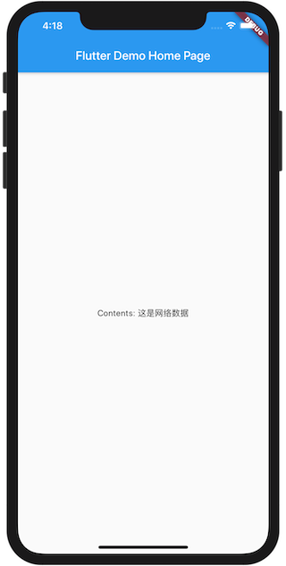

### 1. Dart中事件循环模型


两个任务队列：

* 微任务队列 microtask queue
* 事件队列 event queue

“微任务”优先执行，没有才执行“事件队列”，“事件队列”每次执行一次，“微任务”较少，IO、计时器、点击、绘制属于事件

### 2. 任务调度
#### 2.1 MicroTask队列
``` Dart
void main() {
  print("main start");
  scheduleMicrotask(() => print('microtask'));
  print("main end");
}

flutter: main start
flutter: main end
flutter: microtask
```
#### 2.2 Event队列
```Dart
void main() {
  print("main start");
  Future(() => print('microtask'));
  print("main end");
}

flutter: main start
flutter: main end
flutter: microtask
```

### 3 Future与FutureBuilder

#### 3.1 Future使用
Future() Future.microtask() Future.sync() Future.value() Future.delayed() Future.error() Future.sync()
```dart
void main() {
  print("main start");
  
  // 延时执行
  Future.delayed(Duration(seconds: 1), () => print('1秒后在Event queue中运行的Future'));
  
  // 同步执行，回立即执行
  Future.sync(() => print('同步运行的Future')).whenComplete(() => print('complete'));
  
  // 异步执行，then在异步方法执行完后按顺序执行，
  // 出现错误会执行catchError方法
  // 不管有没有错误最终都会执行whenComplete
  Future(() => print('task'))
      .then((_) => print('callback1'))
      .then((_) => print('callback2'))
      .catchError((error) => print("$error"))
      .whenComplete(() => print('complete'));

  print("main end");
}

// 结果输出
flutter: main start
flutter: 同步运行的Future
flutter: main end
flutter: 在Microtask queue里运行future
flutter: complete
flutter: task
flutter: callback1
flutter: callback2
flutter: complete
flutter: 1秒后在Event queue中运行的Future
```

#### 3.2 Future.wait
等待多个任务完成后回调
```Dart
void main() {
  print("main start");

  Future.wait([
    Future.delayed(Duration(seconds: 2), () => "Hello"),
    Future.delayed(Duration(seconds: 4), () => "Flutter")
  ]).then((results) {
    print("${results[0]} + ${results[1]}");
  }).catchError((e) => print(e));

  print("main end");
}
  
// 输出
flutter: main start
flutter: main end
flutter: Hello + Flutter
  
```

#### 3.3 Completer
和Future最大的区别可以手动控制完成时机

```Dart
  /// Completer
  var completer = Completer();
  // completer中包含一个future
  var future = completer.future;
  // 设置future执行完成后的回调
  future.then((value) => print("then $value"));
  
  print('do something else');
  
  // 可以控制完成时间，然后执行then回调
  completer.complete("done");

  print("main end");
}

// 输出
flutter: main start
flutter: do something else
flutter: main end
flutter: then done
```

#### 3.4 FutureBuilder

使用场景：依赖异步数据动态更新UI.
FutureBuilder根据依赖的future动态构建自身
```Dart
FutureBuilder({
  this.future,   // 依赖的future，通常为一个异步耗时任务
  this.initialData,  // 初始数据，用户设置的默认数据
  @required this.builder,  // Widget构建器，会被Future执行的不同阶段多次调用
})

// builder的构建方法
Function (BuildContext context, AsyncSnapshot snapshot)
// snapshot包含当前异步任务的状态信息和结果信息，
// 比如可以通过snapshot.connectionState获取异步任务状态
// snapshot.hasError判断异步任务是否出现错误
```
FutureBuilder使用
```Dart
void main() {
  runApp(MyApp());
}

class MyApp extends StatelessWidget {
  // This widget is the root of your application.
  @override
  Widget build(BuildContext context) {
    return MaterialApp(
      title: 'Flutter Demo',
      theme: ThemeData(
        primarySwatch: Colors.blue,
      ),
      home: MyHomePage(title: 'Flutter Demo Home Page'),
    );
  }
}

class MyHomePage extends StatefulWidget {
  MyHomePage({Key key, this.title}) : super(key: key);

  final String title;

  @override
  _MyHomePageState createState() => _MyHomePageState();
}

class _MyHomePageState extends State<MyHomePage> {

  Future<String> mockNetworkData() async {
    return Future.delayed(Duration(seconds: 2), () => throw);
  }

  @override
  void initState() {
    super.initState();
  }

  @override
  Widget build(BuildContext context) {
    return Scaffold(
      appBar: AppBar(
        title: Text(widget.title),
      ),
      body: Center(
        child: FutureBuilder<String>(
          future: mockNetworkData(),
          builder: (BuildContext context, AsyncSnapshot snapshot) {
            if(snapshot.connectionState == ConnectionState.done) {
              if(snapshot.hasError) {
                // 请求失败
                return Text("Error: ${snapshot.error}");
              } else {
                // 请求完成
                return Text("Contents: ${snapshot.data}");
              }
            } else {
              // 显示loading
              return CircularProgressIndicator();
            }
          }
        )
      ),
    );
  }

```





### 4 async/await
asnc声明的方法有如下意义

* 方法返回一个Future
* await只能在async中出现
* 该方法会同步执行方法中的代码，直到遇到第一个await，会等待await完成再执行下面的代码，但该方法会在第一个await处返回，
* 一旦由await引用的Future任务完成，await的下一行代码立即执行
* async函数中可以有多个await，每遇见一个就返回一个Future,效果类似then串起来的回调
* async函数可以没有await，执行完毕返回一个Future

```Dart
void main() {
  fool();
}

fool() async {
  print('foo E');
  String v = await bar();
  print('foo X $v');
}

bar() async {
  print('bar E');
  return 'hello';
}

// 输出
flutter: foo E
flutter: bar E
flutter: foo X hello
```


如图所示，await将代码割裂成了两部分，绿框中的代码会同步直到遇到await会马上返回一个Future，红框中的代码你可以看作是在then里面的回调方法，和下面的方法等效
```Dart
fool() async {
  print('foo E');
  return Future.sync(bar).then((v) => print('foo X $v'));
}
```
### 5 Stream与StreamBuilder
Stream也用于接收异步数据，与Future不同在于可以接收多个异步返回结果。可以通过多次触发成功或失败来传递数据或错误异常
使用场景：多次读取数据的异步任务场景，网络内容下载，文件读取等
#### 5.1 Steam使用
```Dart
void main() {
  print('main start');

  Stream.fromFutures([
    // 1秒后返回结果
    Future.delayed(new Duration(seconds: 1), () {
      return "hello 1";
    }),
    // 抛出一个异常
    Future.delayed(new Duration(seconds: 2), () {
      throw AssertionError("Error");
    }),
    // 3秒后返回结果
    Future.delayed(new Duration(seconds: 3), () {
      return "hello 3";
    })
  ]).listen((data) => print(data), onError: (e) => print(e),
      onDone: () => print("Done"));

  print('main end');
}

// 输出
flutter: main start
flutter: main end
flutter: hello 1
flutter: Assertion failed
flutter: hello 3
flutter: Done
```

#### 5.2 StreamBuilder使用
StreamBuilder用于配合Stream来展示流上事件（数据）变化的UI组件
StreamBuilder构造函数
```Dart
StreamBuilder({
  Key key,
  this.initialData,
  Stream<T> stream,
  @required this.builder,
})
```
StreamBuilder使用
```Dart
class _MyHomePageState extends State<MyHomePage> {

  Stream<int> counter() {
    return Stream.periodic(Duration(seconds: 100), (i) => i);
  }

  @override
  void initState() {

    super.initState();
  }

  @override
  Widget build(BuildContext context) {
    return Scaffold(
      appBar: AppBar(
        title: Text(widget.title),
      ),
      body: Center(
        child: buildStream(context)
      ),
    );
  }

  Widget buildStream(BuildContext context) {
    return StreamBuilder<int>(
      stream: counter(),
      builder: (BuildContext context, AsyncSnapshot<int> snapshot) {
        if (snapshot.hasError)
          return Text('Error: ${snapshot.error}');
        switch (snapshot.connectionState) {
          case ConnectionState.none:
            return Text('没有Stream');
          case ConnectionState.waiting:
            return Text('等待数据...');
          case ConnectionState.active:
            return Text('active: ${snapshot.data}');
          case ConnectionState.done:
            return Text('Stream已关闭');
        }
        return null; // unreachable
      },
    );
  }
}

```


