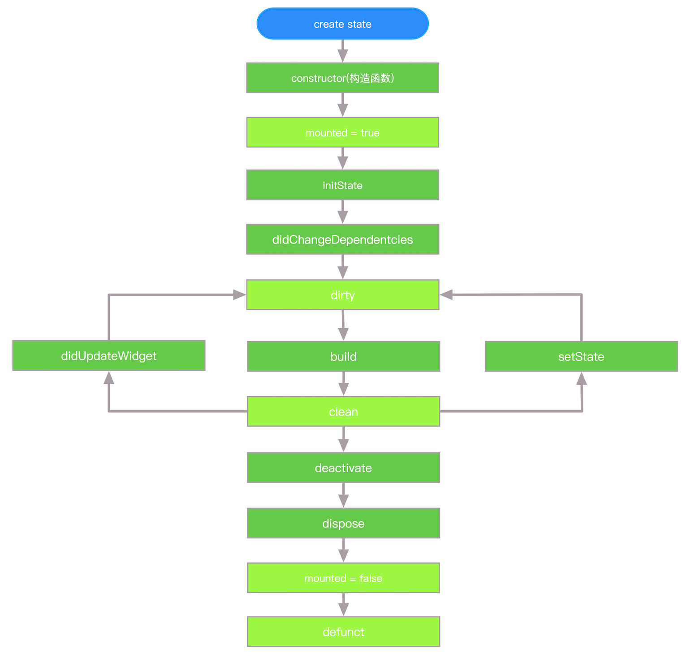

## 前言
在我们日常Flutter开发中，详细大家用的最多的就是StatelessWidget和StatefulWidget。那你有么有认真总结过Flutter Widget的生命周期呢？

## StatelessWidget
StatelessWidget在被创建以后只能被绘制一次。一个StatelessWidget不会因为任何事件活着用户的操作而进行重绘。
```dart
class TestStlWidget extends StatelessWidget {
   const TestStlWidget ({ Key key }) : super(key: key);
    @override
    Widget build(BuildContext context) {
      return Container();
    }
}

```

##  StatefulWidget
与StatelessWidget相反，StatefulWidget是一个可以根据事件或者用户操作进行重绘的widget。在它的生命周期中可以多次的被重绘。下面来看一下StatefulWidget的生命周期




1. **createState():** 当创建一个StatefulWidget时，会调用一个createState方法来创建State
```dart
class FirstPage extends StatefulWidget {
  FirstPage({Key key}) : super(key: key);
  _FirstPagePageState createState() => _FirstPagePageState();
}
```
2. **mounted:** 当调用createState时，一个BuildContext被分派给了这个state。那BuildContext怎么理解呢？其实你可以将BuildContext理解为它所对应的widget在这个渲染树上的一个点。
所有的widget都有mounted这个属性。只有widget的BuildContext被分配了，mounted才会为ture。我们不应该在mounted为false时调用setState方法

3. **initState():** 这是widget被创建以后在构造函数后，第一个被调用的方法。只调用一次，可以在里面初始化一些数据，以及绑定控制器，订阅一些stream，添加一些监听等等

4. **didChangeDependencies():** 这个方法会在initState()方法后立即被调用。如果继承自InheritedWidget的Widget会在数据有变化时其父类的didChangeDependencies也会被调用
```dart

class CountDesWidget extends InheritedWidget {
  final int data; //需要在子树中共享的数据，保存点击次数

  const CountDesWidget({
    Key key,
    this.data = 0,
    @required Widget child,
  })  : assert(child != null),
        super(key: key, child: child);

  static CountDesWidget of(BuildContext context) {
    return context.dependOnInheritedWidgetOfExactType<CountDesWidget>();
  }

  @override
  bool updateShouldNotify(CountDesWidget old) {
    return false;
  }
}

class _TestWidget extends StatefulWidget {
  @override
  __TestWidgetState createState() => new __TestWidgetState();
}

class __TestWidgetState extends State<_TestWidget> {
  @override
  Widget build(BuildContext context) {
    //使用InheritedWidget中的共享数据
    return Text(CountDesWidget.of(context).data.toString());
  }

  @override
  void didChangeDependencies() {
    super.didChangeDependencies();
    //父或祖先widget中的InheritedWidget改变(updateShouldNotify返回true)时会被调用。
    //如果build中没有依赖InheritedWidget，则此回调不会被调用。
    print(" _TestWidget dependencies change");
  }
}

```


5. **build()** 这个方法可以说是最重要的一个方法，用来构建widget。这个方法会再didChangeDependencies()方法后立即被调用。

6. **didUpdateWidget():** 如果父类的widget有变化并且需要重绘UI的时候会被调用。此方法会带有一个oldWidget的参数，你可以和当前的widge做一下对比来处理一些额外的逻辑。此处贴上核心示例代码：
```dart

class SecondPageState extends State<SecondPage> {
  int _counter = 0;

  @override
  void initState() {
    print("second page initState......");

    super.initState();
  }

  //绘制界面
  @override
  Widget build(BuildContext context) {
    print("second page build......");
    return Scaffold(
      appBar: AppBar(title: Text("setState demo")),
      body: Center(
          child: CountDesWidget(
        data: _counter,
        child: Column(
          children: <Widget>[
            RaisedButton(
              onPressed: () {
                setState(() {
                  // 此处在调用setState时，会触发CountWidget的didUpdateWidget的方法
                  _counter++;
                });
              },
              child: CountWidget(count: _counter),
            ),
          ],
        ),
      )),
    );
  }
}

class CountWidget extends StatefulWidget {
  final int count;
  CountWidget({Key key, this.count}) : super(key: key);

  @override
  _CountWidgetState createState() => _CountWidgetState();
}

class _CountWidgetState extends State<CountWidget> {

......
  //绘制界面
  @override
  Widget build(BuildContext context) {
    print("CountWidget build......");
    return Text(
      '点击按钮查看状态变化 count: ${widget.count}',
      style: TextStyle(color: Colors.black),
    );
  }

  //状态改变的时候会调用该方法,比如父类调用了setState
  @override
  void didUpdateWidget(CountWidget oldWidget) {
    super.didUpdateWidget(oldWidget);
    print("CountWidget didUpdateWidget......");
  }

......
}
```


7. **setState():** 此方会经常被Flutter framework自己或者开发者所实使用，以用来重新构建widget

8. **deactivate():** 当state被从树中移除时会被调用。但是它也有可能被重新插入到一个新的地方

9. **dispose():** 当state被渲染树永久移除时，会被调用。

10. **mounted = false** state再也不回被重新分配BuildContext，如果再调用setState则会抛出异常

## WidgetsBindingObserver
如果我们想知道应用什么时候进入后台，什么时候又进入到前台，有什么方法可以监测到呢？接下来我告诉大家怎么做。
只要我们实现WidgetsBindingObserver，来对应用的生命周期进行观测就好
```dart
class _FirstPagePageState extends State<FirstPage> with WidgetsBindingObserver {
  @override
  void initState() {
    super.initState();
    print("first page initState......");
    WidgetsBinding.instance.addObserver(this); //注册监听器
}

  //当State对象从树中被永久移除时调用；通常在此回调中释放资源
  @override
  void dispose() {
    super.dispose();
    WidgetsBinding.instance.removeObserver(this); //移除监听器

    WidgetsBinding.instance.addPostFrameCallback((_) {
      print("first page 单次Frame绘制回调"); //只回调一次
    });

    WidgetsBinding.instance.addPersistentFrameCallback((_) {
      print("first page 实时Frame绘制回调"); //每帧都回调
    });
  }

  //监听App生命周期回调
  @override
  void didChangeAppLifecycleState(AppLifecycleState state) async {
    print("$state");
    if (state == AppLifecycleState.resumed) {

    }
  }

```
详细的示例代码请移步
[Demo](https://github.com/zhao19880827/flutter_study_note)

