### 引言

TCP/IP（Transmission Control Protocol/Internet Protocol，传输控制协议/网际协议）是一组协议簇，用于实现不同网络之间的信息传输。TCP/IP协议不仅仅指的是[TCP](https://baike.baidu.com/item/TCP/33012?fromModule=lemma_inlink) 和[IP](https://baike.baidu.com/item/IP/224599?fromModule=lemma_inlink)两个协议，而是指一个由[FTP](https://baike.baidu.com/item/FTP/13839?fromModule=lemma_inlink)、[SMTP](https://baike.baidu.com/item/SMTP/175887?fromModule=lemma_inlink)、TCP、[UDP](https://baike.baidu.com/item/UDP/571511?fromModule=lemma_inlink)、IP等协议构成的协议簇， 只是因为在TCP/IP协议中TCP协议和IP协议最具代表性，所以被称为TCP/IP协议。TCP/IP协议是现代网络通信的基础，通过学习和理解TCP/IP协议，有利于我们在日常开发中对于网络通讯有更加深刻的了解。

### 网络分层模型

网络协议通常分成不同的层次进行开发，每一层负责不同的通讯功能。TCP/IP目前有两种分层方式：OSI参考模型和四层模型。

#### OSI模型

`OSI参考模型`的全称是`开放系统互连参考模型（Open System Interconnection Reference Model，OSI/RM）`，它是由国际标准化组织ISO提出的一个网络系统互连模型，它是网络技术的基础，也是分析、评判各种网络技术的依据，模型如下：（此处图来自网络）

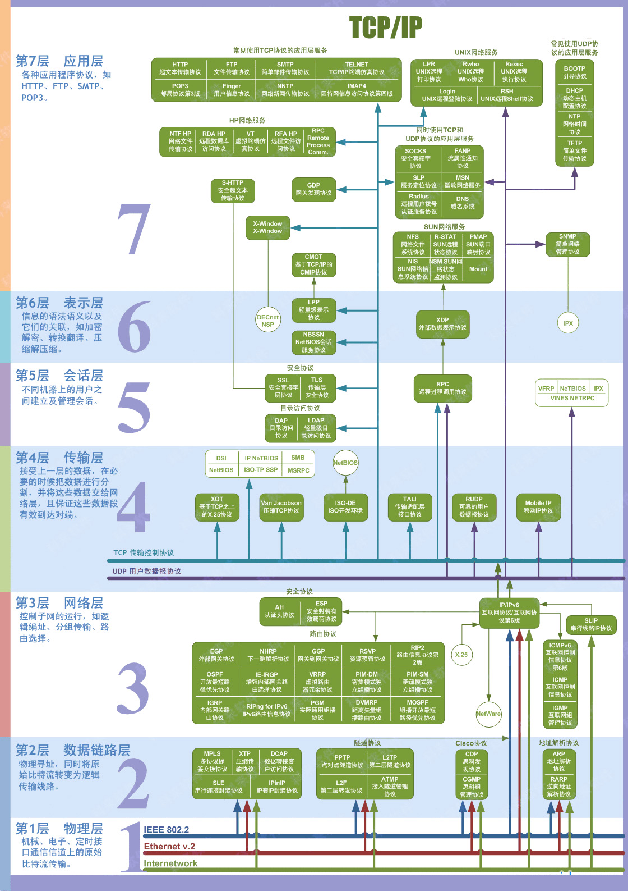

`OSI参考模型`把网络通信的工作分为七层，一至四层被认为是低层，这些层与数据移动密切相关，五至七层是高层，包含应用程序级的数据，每一层负责一项具体工作，然后把数据传送到下一层，由低到高具体分为：物理层、数据链路层、网络层、传输层、会话层、表示层和应用层。

`OSI参考模型`是一个理想模型，由于其复杂性并没有被大家广泛采用。被大家广泛使用的是接下来要介绍的四层模型。

#### 四层模型

TCP/IP通常被认为是一个四层的协议系统，由上至下为：应用层、传输层、网络层和链路层。

- 应用层：应用层一般是我们编写的应用程序决定了向用户提供的应用服务。应用层可以通过系统调用与传输层进行通信。如FTP，DNS，HTTP等；
- 传输层：定义控制数据传输的协议，用以保证数据的可靠性和顺序到达性等，如TCP、UDP协议;
- 网络层：定义不同网络类型间通讯的协议，如IP协议用于实现互联网路由，ICMP 协议用于检测网络的畅通性，ARP协议用于获取设备 MAC 地址等;
- 链路层：链路层用来处理连接网络的硬件部分，包括控制操作系统，硬件设备驱动，NIC（Network Interface Controller，网络适配器）以及光纤等物理可见部分。硬件上的范畴均在链路层的作用范围之内。

四层模型与OSI七层模型的对应关系如下图：

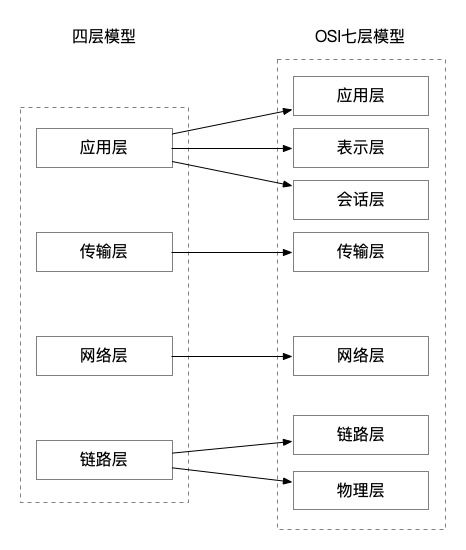

下面将以四层模型为基础，介绍具体每一层的作用。

### 链路层

链路层主要是将数据按照字节为单位进行传输。以太网将一组电讯号作为一个数据包，而一个数据包被称为**一帧**。完整的**一帧**数据包包含一下内容：

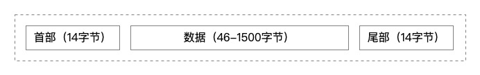

整个数据帧由**首部**、**数据**和**尾部**三部分组成：

- 首部：固定为14个字节，包含了目标MAC地址、源MAC地址和类型
- 数据：最短为46个字节，最长为1500个字节，如果需要传输的数据很长，就必须分割成多个帧进行发送
- 尾部：固定为4个字节，表示数据帧校验序列，用于确定数据包在传输过程中是否损坏

以太网协议通过对电讯号进行分组并形成数据帧，然后通过物理介质把数据帧发送给接收方。以太网规协议定，接入网络的设备都必须安装网络适配器，即**网卡，**数据包必须是从一块网卡传送到另一块网卡。 而**网卡地址**就是数据包的发送地址和接收地址，也就是帧首部所包含的**MAC 地址**，MAC 地址是每块网卡的身份标识。MAC地址采用十六进制标识，共6个字节， 前三个字节是厂商编号，后三个字节是网卡流水号，格式如下：**XX-XX-XX-XX-XX-XX**。

拥有MAC地址后，以太网通过广播方式向子网内的所有设备发送数据包。在这个过程中，每个设备接收到数据包时，都会检查数据包头部的目标MAC地址，并将其与自己的MAC地址进行匹配。如果两者地址一致，设备就会对数据包进行进一步的处理；如果地址不匹配，则该设备会忽略并丢弃这个数据包。

综上可以看出，链路层的主要作用就是**对电讯号进行分组并形成具有特定意义的数据帧，然后以广播的形式通过物理介质发送给接收方。**

### 网络层

网络层主要是根据IP找到IP对应的设备。网络层主要通过IP协议、ARP协议、路由协议来进行数据传输和定位的。

#### IP协议

由于**MAC地址**是网卡的唯一标识，所以可以用来确定目标设备，但是**MAC地址**没有规律性无法作为通讯协议。所以网络通讯基于IP协议来进行。IP地址目前有两个版本，分别是**IPv4**和**IPv6**，IPv4是一个32位的地址，常采用4个十进制数字表示。 IP协议将这个32位的地址分为两部分，前面部分代表网络地址，后面部分表示该主机在区域网中的地址。 

##### IP路由流程

当一个IP数据包准备好了以后，IP数据包会选择一条最优的路径进行“送货”。IP路由路径选择流程如下：

1. 搜索路由表，优先搜索匹配主机，如果能找到和 IP 地址完全一致的目标主机，则将该包发向目标主机。
2. 搜索路由表，如果匹配主机失败，则匹配同子网的路由器，这需要「**子网掩码**」的协助。 如果找到路由器，则将该包发向路由器。
3. 搜索路由表，如果匹配同子网路由器失败，则匹配同**网号**路由器，如果找到路由器，则将该包发向路由器。
4. 搜索路由表，如果以上都失败了，就搜索默认路由，如果默认路由存在，则发包。
5. 如果都失败了，就丢掉这个包。

通过上述流程也可以发现**IP 包是不可靠的，因为它不保证送达。**

##### ARP协议

ARP 叫做地址解析协议，是根据**IP 地址**获取**MAC 地址**的一个网络层协议。 其工作原理如下图所示：

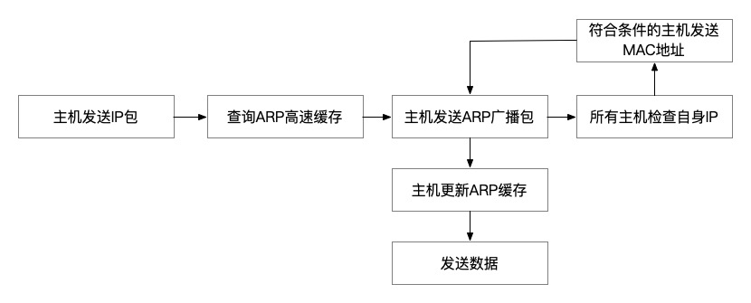

1. 主机在发送正式数据前会先发起一个请求数据包，数据包的首部包含了目标主机的IP地址，然后这个数据包会在链路层进行再次包装，生成**以太网数据包**
2. 此次请求会优先查询自身的ARP高速缓存，如果缓存中存有目标主机的MAC地址，则主机直接发送数据，如果没有则进行第3步
3. 以太网会将**以太网数据包**广播给子网内的所有主机，每一台主机都会接收到这个数据包，并取出标头里的IP地址，然后和自己的IP地址进行比较，如果相同就返回自己的MAC地址，如果不同就丢弃该数据包
4. ARP接收返回消息，以此确定目标机的MAC地址;与此同时，ARP还会将返回的MAC地址与对应的IP地址存入本机ARP快取中并保留一定时间，下次请求时直接查询ARP快取以节约资源。

##### 路由协议

通过ARP协议的工作原理可以发现，**ARP 的 MAC 定址还是局限在同一个子网中**，因此网络层引入了路由协议，首先通过 IP 协议来判断两台主机是否在同一个子网中，如果在同一个子网，就通过 ARP 协议查询对应的 MAC 地址，然后以广播的形式向该子网内的主机发送数据包;如果不在同一个子网，以太网会将该数据包转发给本子网的**网关**进行路由。 网关是互联网上子网与子网之间的桥梁，所以网关会进行多次转发，最终将该数据包转发到目标 IP 所在的子网中，然后再通过 ARP 获取目标机 MAC，最终也是通过广播形式将数据包发送给接收方。

而完成这个路由协议的物理设备就是**路由器，**在错综复杂的网络世界里，路由器扮演者**交通枢纽**的角色，它会根据信道情况，选择并设定路由，以最佳路径来转发数据包。

##### IP数据包

在网络层被包装的数据包就叫**IP数据包**，IPv4数据包的结构如下图所示：

IP 数据包由 首部 和 数据 两部分组成：

- 首部：长度为 20 个字节，主要包含了目标 IP 地址和源 IP 地址，目标 IP 地址是网关路由的线索和依据
- 数据：最大长度为 65515 字节，理论上一个IP数据包的总长度可以达到65535个字节，而以太网数据包的最大长度是1500个字节，如果超过这个大小，就需要对IP数据包进行分割，分成多帧发送。

### 传输层

链路层定义了主机的身份，即 MAC 地址， 而网络层定义了 IP 地址，明确了主机所在的网段，有了这两个地址，数据包就从可以从一个主机发送到另一台主机。 但实际上数据包是从一个主机的某个应用程序发出，然后由对方主机的应用程序接收。 而每台电脑都有可能同时运行着很多个应用程序，所以当数据包被发送到主机上以后，是无法确定哪个应用程序要接收这个包。

因此传输层引入了**UDP 协议**来解决这个问题，为了给每个应用程序标识身份，UDP 协议定义了**端口**，同一个主机上的每个应用程序都需要指定唯一的端口号，并且规定网络中传输的数据包必须加上端口信息。 这样，当数据包到达主机以后，就可以根据端口号找到对应的应用程序了。

#### UDP协议

 UDP 定义的数据包就叫做 UDP 数据包，结构如下所示：

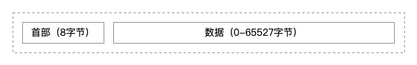

UDP 数据包由首部和数据两部分组成：

- 首部： 8 个字节，主要包括源埠和目标端口
- 数据： 65527 个字节，整个数据包的长度最大可达到 65535 个字节

UDP的首部结构如下图所示：

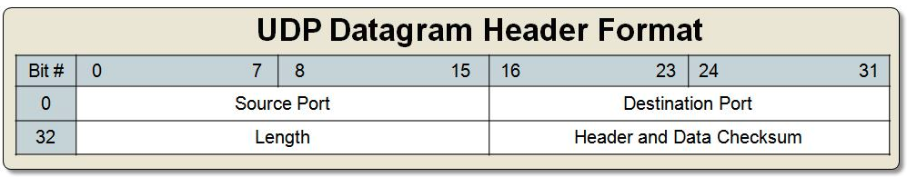

- Source Port：源端口，即为发送数据的端口
- Destination Port：目标端口，数据要”送达”的端口
- Length：UDP的长度，最小值为8字节，仅有首部
- Header and Data Checksum：校验用户数据报在传输过程是否有错，有错就丢弃

#### TCP协议

UDP 协议比较简单，实现容易，但它没有确认机制， 数据包一旦发出，无法知道对方是否收到，因此可靠性较差，为了解决这个问题，提高网络可靠性，**TCP 协议**就诞生了，TCP 即传输控制协议，是一种面向连接的、可靠的、基于字节流的通讯协议。 简单来说 TCP 就是有确认机制的 UDP 协议，每发出一个数据包都要求确认，如果有一个数据包丢失，就收不到确认，发送方就必须重发这个数据包。
TCP 数据包和 UDP 一样，都是由首部和数据两部分组成，唯一不同的是，TCP 数据包没有长度限制，理论上可以无限长，但是为了保证网络的效率，通常 TCP 数据包的长度不会超过IP数据包的长度，以确保单个 TCP 数据包不必再分割。TCP协议的首部结构如下图所示：

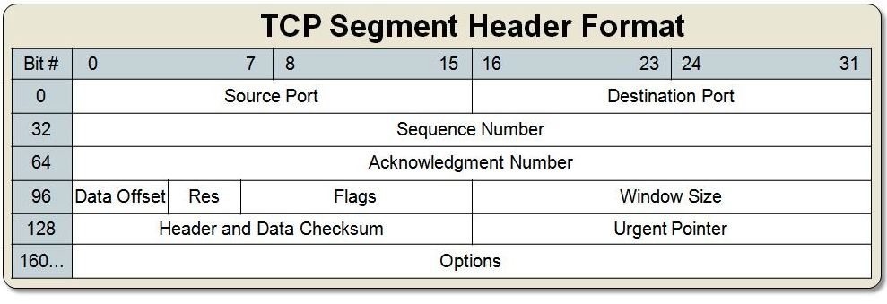

- Source Port：源端口号，即为发送数据的端口
- Destination Port：目标端口，数据要”送达”的端口
- Sequence NUmber：32 位序号。 TCP 提供全双工服务，两端都有各自的序号。 **编号：解决网络包乱序的问题**;基于时钟生成一个序号，每4微秒加一，到 '2^32- 时又从 0 开始;
- Acknowledgment Number：32位确认序列号。上次成功收到数据字节序号加1，ack为1次啊有效。**确认号：解决丢包的问题**;
- Data Offset：前 4bit 为首部长度，包括TCP头大小，指示何处数据开始
- Res：后面 6bit 为保留位，这些位必须是 0，为了将来定义新的用途而保留
- Flags：最后面 6bit 为标志域，
  - URG：紧急指针（urgent pointer）有效
  - ACK：acknowledgement 确认，占1位，仅当ACK=1时，确认号栏位才有效，ACK=0时，确认号无效;
  - PSH：push 传送，提示接收端立即从缓冲区把数据取走;
  - RST：reset 重置，要求重新建立连接
  - SYN：synchronous 建立连接，连接建立时用于同步序号。 当 SYN=1，ACK=0 时表示：这是一个连接请求报文段。 若同意连接，则在响应报文段中使得SYN=1，ACK=1。 因此，SYN=1表示这是一个连接请求，或连接接受报文。 SYN 这个标志位只有在 TCP 建立连接时才会被置为1，握手完成后 SYN 标志位被置 0;
  - FIN：用来释放一个连接。 FIN=1表示：此报文段的发送方的数据已经发送完毕，并要求释放运输连接
- Window Size：窗口大小，接收端期望接收的字节数。 窗口大小是一个16字节字段，因而窗口大小最大为65535字节
- Header and Data Checksum：校验和。 由发送端计算和存储，由接收端校验
- Urgent Pointer：紧急指针。 指向后面是优先数据的字节，在URG标志设置了时才有效。 如果URG标志没有被设置，紧急域作为填充。 加快处理标示为紧急的数据段
- Options：这个是额外的功能，提供包括安全处理机制、路由纪录、时间戳记、严格与宽松之来源路由等

##### 三次握手

为了保证传输的可靠性，TCP协议在 UDP 基础之上建立了**三次对话**的确认机制，经过三次对话之后，主机A才会向主机B发送正式数据。三次握手的流程如下图所示：

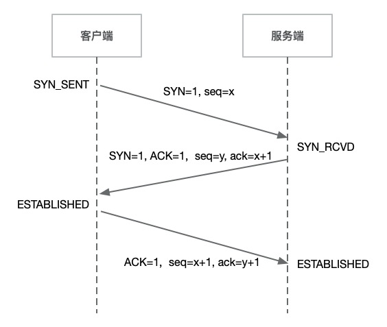

1. 第一次握手：客户端将标志位SYN=1，seq=x（x为随机生成的值）的TCP数据包发送给服务端，客户端进入SYN_SENT状态，等待服务端确认。
2. 第二次握手：服务端收到数据包后，根据标志位SYN=1确定客户端请求建立连接，服务端将标志SYN和ACK都置为1，ack=x+1，并生成seq=y（y为随机生成的值），然后将该数据包发送给客户端已确认连接请求，服务端进入SYN_RCVD状态。
3. 第三次握手：客户端收到确认数据包后，检查ack是否为x+1，ACK是否为1，如果正确则将标志位ACK置为1，ack=y+1，seq=x+1，然后将数据包发送给服务端，服务端检查ack是否为y+1，ACK是否为1，如果正确则连接建立成功，客户端和服务端进入ESTABLISHED状态，完成三次握手，随后客户端和服务端开始进行数据传输。

##### 四次挥手

四次挥手的流程如下图所示：

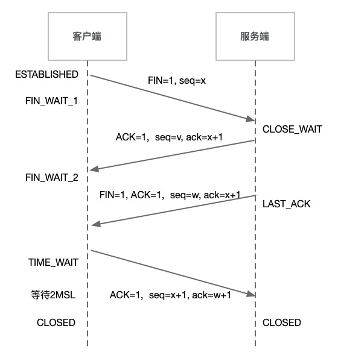

1. 第一次挥手：客户端发送FIN=1，seq=x的包给服务端，表示自己没有数据要进行传输了，单面连接传输要关闭。发送完以后，客户端进入FIN-WAIT-1状态
2. 第二次挥手：服务端接收到请求包后，发送ACK=1，ack=x+1，seq=v（随机生成）的确认包，表示确认断开连接。服务端进入CLOSE_WAIT状态。客户端收到该包以后，进入FIN_WAIT_2状态。此时客户端到服务端的数据连接断开
3. 第三次挥手：服务端发送FIN=1，ack=x+1，seq=w（随机生成）的包给客户端，标识自己没有数据给客户端了，发送完以后进入LAST_ACK状态，等待客户端的确认包
4. 四次挥手：客户端收到FIN=1的数据包后，知道可以关闭连接了，然而他还是不相信网络，怕服务器不知道关闭，所以发送ACK=1，ack=w+1，seq=w+1的数据包给服务端，然后进入TIME_WAIT状态。服务端收到该数据包后，就可以断开连接了。客户端在等待了2MSL后依然没有收到回复，则认为服务端已经正常关闭，然后客户端也关闭连接。

状态注解：

**FIN_WAIT_1**：FIN_WAIT_1 和 FIN_WAIT_2 状态的真正含义都是表示等待对方的 FIN 报文。 而这两种状态的区别是：FIN_WAIT_1 状态实际上是当 SOCKET 在 ESTABLISHED 状态时，它想主动关闭连接，向对方发送了 FIN 报文，此时该 SOCKET 即进入到 FIN_WAIT_1 状态。 而当对方回应 ACK 报文后，则进入到 FIN_WAIT_2 状态，当然在实际的正常情况下，无论对方何种情况下，都应该马上回应 ACK 报文，所以 FIN_WAIT_1 状态一般是比较难见到的，而 FIN_WAIT_2 状态还有时常常可以用 看到。netstat

**TIME_WAIT**： 表示收到了对方的 FIN 报文，并发送出了ACK 报文，就等**2MSL**后即可回到 CLOSED 可用状态了。 如果FIN_WAIT_1状态下，收到了对方同时带FIN标志和ACK标志的报文时，可以直接进入到TIME_WAIT状态，而无须经过FIN_WAIT_2状态。

**MSL（最大分段生存期）：指 TCP 报文在 Internet 上最长生存时间，每个具体的 TCP 实现都必须选择一个确定的 MSL 值。 RFC 1122 建议是 2 分钟，但 BSD 传统实现采用了 30 秒。 TIME_WAIT 状态最大保持时间是 2 \* MSL，也就是 1-4 分钟。**

 UDP 是面向非连接的协议，它不与对方建立连接，而是直接就把数据包发过去了。 所以 TCP 能够保证数据包在传输过程中不被丢失，但美好的事物必然是要付出代价的，相比 UDP，TCP 实现过程复杂，消耗连接资源多，传输速度慢。

### 应用层

理论上讲以上三层协议已经可以完全支持数据从一台主机传输到另一台主机。 但是考虑到数据传输的安全性，数据流粘包拆包相关，数据格式规范化等等问题，在应用层定义了各种各样的协议来规范数据传输的标准和基础的校验，常见的有 http、FTP、SMTP 等，通过这些规范化协议约定数据传输双方的行为。

### 总结

通过上述的分析我们可以看出数据进入TCP/IP协议的封装过程如下头所示：

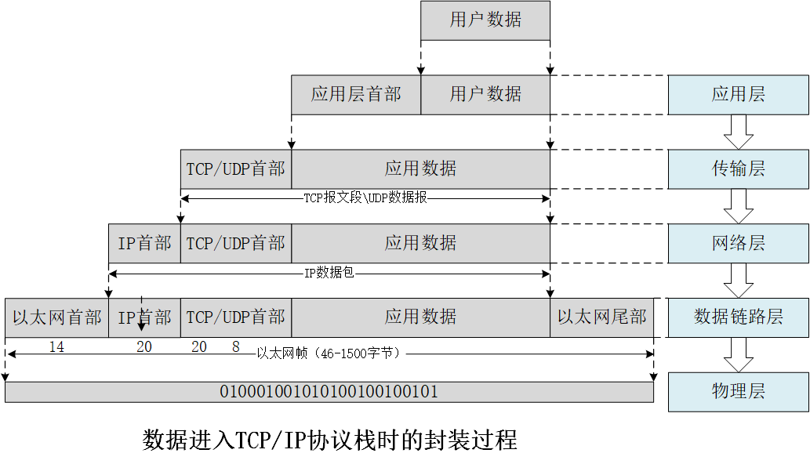

数据进入TCP/IP协议栈时的解析装过程如下：

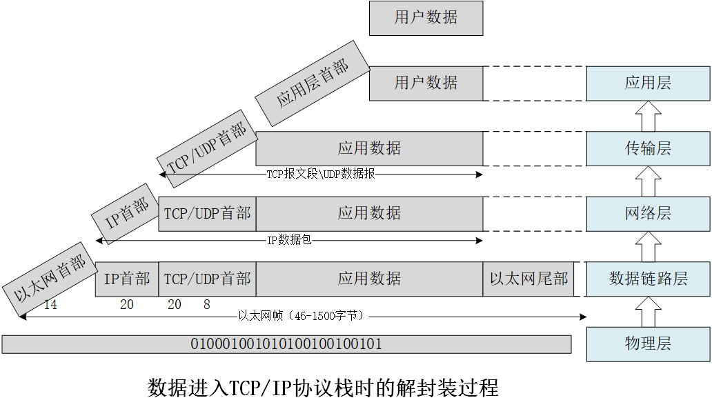
