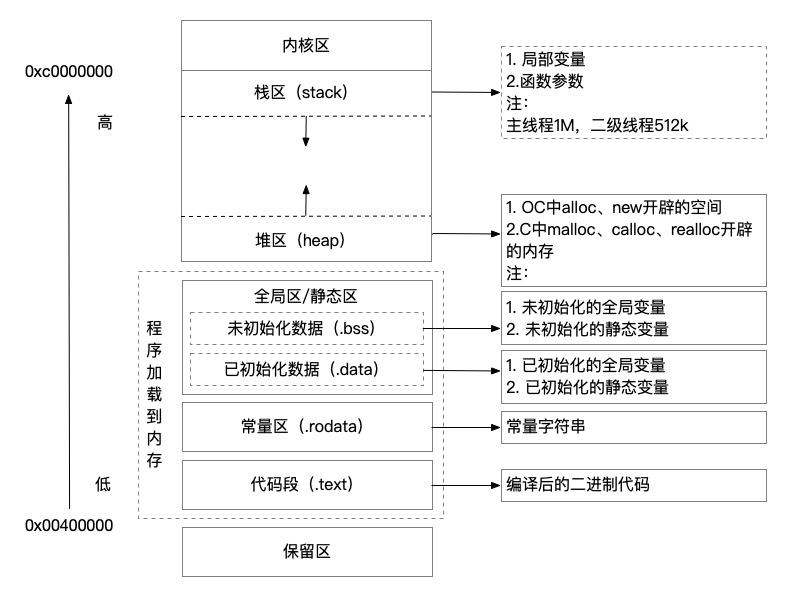

### 引言

iOS的内存分区是开发iOS应用程序时非常重要的一部分。内存管理对于应用的性能和稳定性至关重要，而内存分区则是帮助开发者有效管理和利用内存的关键。在iOS中，内存主要分为五大区域：`栈区`、`堆区`、`全局/静态区`、`常量区`、`代码区`

### 栈区（Stack）

- 函数内部定义的`局部变量和方法的参数`（方法中默认参数：self、cmd），都存放在栈区;
- 栈区的内存空间由`系统管理`，申明的变量过了作用域范围后内存便会自动释放；
- 栈是`一块连续的内存区域`从`高地址向低地址`进行存储，遵循`FILO先进后出`原则；
- iOS主线程栈大小是1MB，二级线程是512KB；
- 方法的调用也是在栈中进行；
- 栈区一般在运行时分配

优缺点：

- 优点：栈是由系统自动分配并释放的，不会产生内存碎片，所以快速高效，开发人员无需关注内存释放问题
- 缺点：由于栈区主线程只有1M，二级线程只有512KB的内存限制，所以数据灵活性较差

### 堆区（Heap）

- 一般在OC语法下由`alloc`、`new`，C语法下`malloc`、`calloc`、`realloc`等内存分配方式创建的变量；
- 由`低地址向高地址`进行分配；
- 堆是`不连续的内存区域`，类似于`链表结构`（便于增删，不便于查询），遵循先进先出（FIFO）原则；
- 访问堆区中的内存是，一般需要先通过读取在栈区中的指针地址来进行访问；

优缺点：

- 优点：获得空间灵活，分配内存较大；
- 缺点：需要手动管理内存，容易造成碎片；

### 全局区/静态区（.bss & .data）

- 全局区是由编译时分配的内存，程序结束时由系统释放；
- .bss：未初始化的全局变量和静态变量；
- .data：已初始化的全局变量和静态变量；
- 可读可写；

### 常量区（.rodata）

- 常量区是编译时分配的内存，程序结束时由系统释放；
- 存放常量:`整型、字符型，浮点，字符串等`，用`const`进行修饰的变量;

### 代码区（.text）

- 代码会被编译成二进制存进内存的代码区域；

### 总结

根据上面对iOS内存分区的介绍，总结下图所示：

