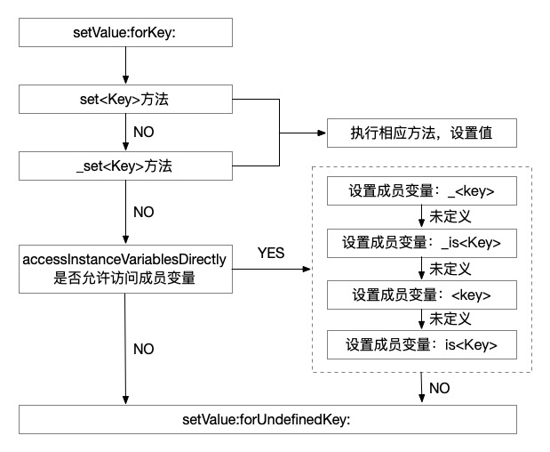
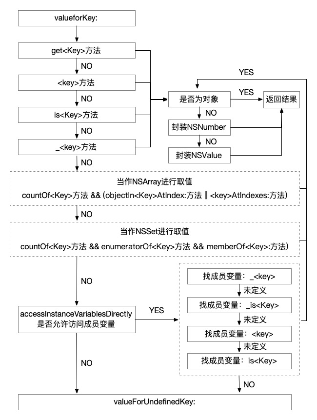

### 引言

在iOS开发中，KVC（Key-Value Coding）扮演着一个非常重要的角色。它是一种基于键的访问方式，通过使用键来访问对象的属性和成员变量，而不是直接通过访问器方法或实例变量来操作。以下是介绍KVC在iOS中的重要性的几个关键点：

1. 简化代码：KVC可以大大简化代码，使开发人员能够以更简洁的方式访问和操作对象的属性。通过使用KVC，您可以使用一个键来获取或设置对象的属性，而不需要手动编写大量的访问器方法。
2. 动态访问属性：KVC允许您在运行时动态地访问和操作对象的属性。这使得您可以根据特定的需求来动态地获取和设置属性值，而不需要在编译时就确定访问器的名称。
3. 遍历复杂对象图：KVC支持键路径，这意味着您可以使用一条路径来访问嵌套对象的属性。这对于遍历和操作复杂对象图非常有用，例如在Core Data中进行关联对象的查询和更新操作。
4. 集合操作：KVC提供了一系列用于集合操作的方法，例如对数组进行排序、过滤和映射等。这些方法可以帮助您更方便地对集合进行操作，而不需要手动编写循环和条件语句。
5. 与其他框架的集成：KVC是许多其他框架和技术的基础，例如键值观察（KVO）和绑定（Binding）。通过使用KVC，您可以更轻松地与这些框架进行集成，实现数据的观察和绑定。

### KVC流程分析

通过底层代码我们可以看到，`NSObject`实现了一个叫`NSKeyValueCoding`的分类，这个分类里提供了一系列关于KVC的的API，下面我们列出一些主要的API，代码如下：

```objective-c
@interface NSObject(NSKeyValueCoding)
// 通过 Key 读取和存储
- (nullable id)valueForKey:(NSString *)key;
- (void)setValue:(nullable id)value forKey:(NSString *)key;

// 通过 keyPath 读取和存储
- (nullable id)valueForKeyPath:(NSString *)keyPath;           
- (void)setValue:(nullable id)value forKeyPath:(NSString *)keyPath;  

// 默认返回YES,若没有找到Set<Key>方法,按照_key、_iskey、key、iskey顺序搜索成员
+ (BOOL)accessInstanceVariablesDirectly;

// KVC提供属性值正确性验证的API,它可以用来检查set的值是否正确,为不正确的值做一个替换值或者拒绝设置新值并返回错误原因
- (BOOL)validateValue:(inout id __nullable * __nonnull)ioValue forKey:(NSString *)inKey error:(out NSError **)outError;

// 这是集合操作的API,里面还有一系列这样的API,如果属性是一个NSMutableArray,那么可以用这个方法来返回
- (NSMutableArray *)mutableArrayValueForKey:(NSString *)key;

// 如果Key不存在,且KVC无法搜索到任何和Key有关的字段或者属性,则会调用这个方法，默认是抛出异常
- (nullable id)valueForUndefinedKey:(NSString *)key;

// 和上一个方法一样,但这个方法是设值
- (void)setValue:(nullable id)value forUndefinedKey:(NSString *)key;

//如果你在SetValue方法时给Value传nil,则会调用这个方法
- (void)setNilValueForKey:(NSString *)key;

//输入一组Key,返回该组Key对应的Value,再转成字典返回,用于将Model转到字典
- (NSDictionary<NSString *, id> *)dictionaryWithValuesForKeys:(NSArray<NSString *> *)keys;
@end
```

通过上述代码，我们可以知道，凡是继承自`NSObject`的类都拥有KVC得能力。于此同时，`NSArray`、`NSMutableDictionary`、`NSOrderedSet`以及`NSSet`也分别实现了自己的不同于`NSObect`相关API的实现。下面我们将研究重点放在最基础的`NSObject`的KVC实现上，为了搞清楚KVC得底层流程，我们将通过苹果的[官方文档](https://developer.apple.com/library/archive/documentation/Cocoa/Conceptual/KeyValueCoding/SearchImplementation.html#//apple_ref/doc/uid/20000955-CJBBBFFA)进行梳理分析。

通过[官方文档](https://developer.apple.com/library/archive/documentation/Cocoa/Conceptual/KeyValueCoding/SearchImplementation.html#//apple_ref/doc/uid/20000955-CJBBBFFA)，我们可以了解到`NSObject(NSKeyValueCoding)` 是对`NSKeyValueCoding`协议的实现。`NSObject` 提供的 NSKeyValueCoding 协议的默认实现，使用一组明确定义的规则将基于`key`的访问器调用映射到对象的底层属性。这些协议方法使用`key`作为参数来搜索自己的对象实例，以查找遵循某些命名约定的访问器、实例变量和相关方法。尽管我们很少修改默认搜索，但了解它的工作原理会很有帮助，这既有助于跟踪键值编码对象的行为，也有助于使我们的代码更具有兼容性。

### setValue:forKey:流程分析

通过[官方文档](https://developer.apple.com/library/archive/documentation/Cocoa/Conceptual/KeyValueCoding/SearchImplementation.html#//apple_ref/doc/uid/20000955-CJBBBFFA)我们可以了解到`setValue:forKey:`的代码流程如下图所示：



通过上图我们可以看到，`setValue:forKey:`流程如下：

1. 在调用`setValue:forKey:`时，会先查找`set<Key>`方法，如果代码中有实现则直接调用`set<Key>`方法进行设置
2. 如果`set<Key>`方法并没有实现，则查找`_set<Key>`方法，如果代码中有实现则直接调用`_set<Key>`方法进行设置
3. 如果两个方法都没有实现，则调用`accessInstanceVariablesDirectly`方法，询问是否可以直接对实例变量进行访问，
   - 如果返回`NO`，则直接调用`setValue:forUndefinedKey:`方法，抛出异常
   - 如果返回`YES`，则执行第4步
4. 依次尝试设置实例变量`_<key>`、`_is<Key>`、`<key>`、`is<Key>`，如果代码中对这四个实例变量都没有进行定义，则会调用`setValue:forUndefinedKey:`方法，抛出异常

### valueForKey:流程分析

通过[官方文档](https://developer.apple.com/library/archive/documentation/Cocoa/Conceptual/KeyValueCoding/SearchImplementation.html#//apple_ref/doc/uid/20000955-CJBBBFFA)我们可以了解到`valueForKey:`的代码流程如下图所示：



通过上图我们可以看到，`valueForKey:`流程如下：

1. 在调用`valueForKey:`方法时，先依次查找`get<Key>`、`<key>`、`is<Key>`、`_<key>`4个方法，
   - 如果代码中有实现，进行取值，并跳转到第6步
   - 如果没有实现，则跳转到第2步
2. 查找是否有`countOf<Key>`方法，并且`objectIn<Key>AtIndex:` 和`<key>AtIndexes:`两个方法中至少有一个，
   - 如果满足条件，则把其当作`NSAarry`来对待进行取值，并跳转到第6步
   - 如果不满足条件，则跳转到第3步
3. 查找代码中是否同时实现了`countOf<Key>` 、`enumeratorOf<Key>`  、`memberOf<Key>:`3个方法
   - 如果同时实现了，则将其当作NSSet来对待进行取值，并跳转到第6步
   - 如果没有同时实现，则跳转到第4步
4. 调用`accessInstanceVariablesDirectly`方法，询问是否可以直接对实例变量进行访问
   - 如果返回`NO`，则直接调用`valueForUndefinedKey:`方法，抛出异常
   - 如果返回`YES`，则跳转到第5步
5. 依次查找`_<key>`、`_is<Key>`、`<key>`、`is<Key>`4个成员变量
   - 如果代码中都没有定义，则直接调用`valueForUndefinedKey:`方法，抛出异常
   - 如果代码中有定义，则取对应的实例变量的值，并跳转到第6步
6. 将获取到的值，进行是否为对象指针的判断
   - 如果是对象指针，则直接返回结果
   - 如果不是，则尝试将其分装为NSNumber或者NSValue，并将结果返回

