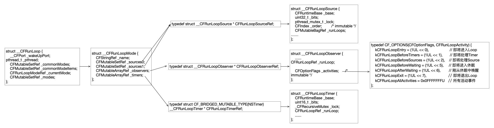
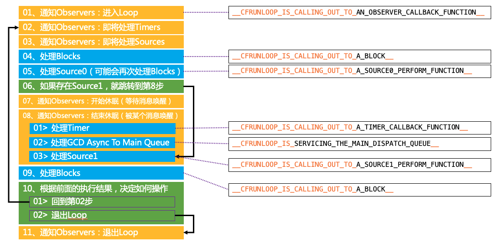

### 引言

在iOS开发中，Runloop是iOS应用程序的核心机制之一，它负责处理事件、定时器(Timer)、界面刷新、手势识别等事件。NSRunLoop的底层是对CFRunLoop的封装，而CFRunLoop则属于[CoreFundation](https://github.com/opensource-apple/CF)类库，接下来我们将基于苹果开源的[CoreFundation](https://github.com/opensource-apple/CF)类库进行分析研究。

### RunLoop源码分析

RunLoop就是在iOS应用程序运行过程中循环处理事件，它能够确保你的应用始终处于响应事件的状态。当有任务需要处理时，RunLoop会立刻做出响应；而在空闲时，它会进入休眠状态，不会占用CPU资源。这样可以有效地管理应用的事件处理，提高效率，并且节省对于的消耗。RunLoop的本质就是在`do...while`循环中不断的处理各种事件的过程。每循环一次，线程就会对此次所在循环里的事件进行处理。我们的应用程序是靠事件驱动的，比如网络回调、UI刷新、定时任务等等都可以被理解为是一个个的事件。一般情况下，一个线程只能在一次执行一个任务，任务完成以后就自动退出了，如果想要线程长时间的保持`活着`的状态就用到了RunLoop，RunLoop可以保证线程在处理完任务以后不会退出，仍然可以等待下次进行对事件的处理。

那下面我们从[CoreFundation](https://github.com/opensource-apple/CF)代码库中找到`CFRunLoop.c`进行源码分析，CFRunLoop所涉及的整体类图如下图所示:



通过上图我们可以发现：

- 一个`__CFRunLoop`包含多个`__CFRunLoopMode`
- 一个`__CFRunLoop`一次只能在一个`__CFRunLoopMode`下运行，如果想要切换Mode在需要退出当前的Mode，再进入新的Mode的中
- 每个RunLoopMode包含若干个`__CFRunLoopSource`、`__CFRunLoopObserver`和`__CFRunLoopTimer`

#### __CFRunLoop定义

```c++
struct __CFRunLoop {
    pthread_mutex_t _lock;						// 访问mode集合时用到的锁
    __CFPort _wakeUpPort;							// 手动唤醒runloop的端口。初始化runloop时设置，仅用于CFRunLoopWakeUp，CFRunLoopWakeUp函数会向_wakeUpPort发送一条消息
    pthread_t _pthread;								// 对应的线程
    CFMutableSetRef _commonModes;			// 集合，存储的是字符串，记录所有标记为common的modeName
    CFMutableSetRef _commonModeItems;	// 存储所有commonMode的sources、timers、observers
    CFRunLoopModeRef _currentMode;		// 指的是该线程现在所处的运行模式，RunLoop在某一时刻只能且必须在一种特定运行模式下执行
    CFMutableSetRef _modes;						// 集合，存储的是CFRunLoopModeRef
    struct _block_item *_blocks_head; // 链表头指针，该链表保存了所有需要被runloop执行的block。外部通过调用CFRunLoopPerformBlock函数来向链表中添加一个block节点。runloop会在CFRunLoopDoBlock时遍历该链表，逐一执行block
    struct _block_item *_blocks_tail; // 链表尾指针，之所以有尾指针，是为了降低增加block时的时间复杂度
};
```

#### __CFRunLoopMode

```c++
typedef struct __CFRunLoopMode *CFRunLoopModeRef;

struct __CFRunLoopMode {
    CFStringRef _name;							// mode名字
    Boolean _stopped;	  						// mode的状态，标识mode是否停止
    CFMutableSetRef _sources0;			// sources0事件集合
    CFMutableSetRef _sources1;			// sources1事件集合
    CFMutableArrayRef _observers;		// 观察者数组
    CFMutableArrayRef _timers;			// 定时器数组
    CFMutableDictionaryRef _portToV1SourceMap;	 //字典。key是mach_port_t，value是CFRunLoopSourceRef
    __CFPortSet _portSet;						// 端口的集合。保存所有需要监听的port，比如_wakeUpPort，_timerPort都保存在这个数组中
    CFIndex _observerMask; 					// 添加obsever时设置_observerMask为observer的_activities（CFRunLoopActivity状态）
};
```

在[苹果官方文档](https://developer.apple.com/documentation/foundation/nsrunloopmode#1789076)中提到了五个Mode：

```objective-c
NSRunLoopCommonModes
A pseudo-mode that includes one or more other run loop modes.
    
NSDefaultRunLoopMode
The mode set to handle input sources other than connection objects.
    
NSEventTrackingRunLoopMode   // Cocoa
The mode set when tracking events modally, such as a mouse-dragging loop.
    
NSModalPanelRunLoopMode   // Cocoa
The mode set when waiting for input from a modal panel, such as a save or open panel.

UITrackingRunLoopMode     // iOS
The mode set while tracking in controls takes place.
```

- `NSRunLoopCommonModes`：一个包含一个或多个其他运行循环模式的伪模式。这是一个占位用的Mode，不是一种真正的Mode，而是一种模式组合，一个操作 Common 标记的字符串，我们可以用这个字符串来操作 Common Items。
- `NSDefaultRunLoopMode`：App的默认Mode，通常主线程是在这个Mode下运行 
- `NSEventTrackingRunLoopMode(Cocoa)` && `UITrackingRunLoopMode(iOS )`：`NSEventTrackingRunLoopMode`对应的是Cocoa环境，`UITrackingRunLoopMode`对应的iOS环境。两者都是处理用户界面相关的事件,例如在拖动loop或其他user interface tracking loops时处于此种模式下，在此模式下会限制输入事件的处理。例如，当手指按住UITableView拖动时就会处于此模式。
- `NSModalPanelRunLoopMode(Cocoa)`：使用这种模式来识别用于模态面板的事件，需要等待处理的input source为modal panel时设置，比如NSSavePanel和NSOpenPanel。

虽然官方文档中定义了5种模式，但是除了上述的模式以外，还有很多其他的[mode](https://iphonedev.wiki/CFRunLoop)。

#### __CFRunLoopSource

`__CFRunLoopSource`利用联合体定义了两个版本的source，分别是version0和version1。version0和version1分别对应source0和source1，如下图所示:

```c
struct __CFRunLoopSource {
    CFRuntimeBase _base;
    uint32_t _bits;
    pthread_mutex_t _lock;
    CFIndex _order;			/* immutable */
    CFMutableBagRef _runLoops;   // 一个runloop集合，无序且允许重复
    union {
	CFRunLoopSourceContext version0; // 对应source0	
        CFRunLoopSourceContext1 version1; // 对应source1	
    } _context;
};

typedef struct {
    CFIndex	version;
    void *	info;
    const void *(*retain)(const void *info);
    void	(*release)(const void *info);
    CFStringRef	(*copyDescription)(const void *info);
    Boolean	(*equal)(const void *info1, const void *info2);
    CFHashCode	(*hash)(const void *info);
    void	(*schedule)(void *info, CFRunLoopRef rl, CFStringRef mode);
    void	(*cancel)(void *info, CFRunLoopRef rl, CFStringRef mode);
    void	(*perform)(void *info);
} CFRunLoopSourceContext;

typedef struct {
    CFIndex	version;
    void *	info;
    const void *(*retain)(const void *info);
    void	(*release)(const void *info);
    CFStringRef	(*copyDescription)(const void *info);
    Boolean	(*equal)(const void *info1, const void *info2);
    CFHashCode	(*hash)(const void *info);
#if (TARGET_OS_MAC && !(TARGET_OS_EMBEDDED || TARGET_OS_IPHONE)) || (TARGET_OS_EMBEDDED || TARGET_OS_IPHONE)
    mach_port_t	(*getPort)(void *info);
    void *	(*perform)(void *msg, CFIndex size, CFAllocatorRef allocator, void *info);
#else
    void *	(*getPort)(void *info);
    void	(*perform)(void *info);
#endif
} CFRunLoopSourceContext1;
```

Source0：source0是App内部事件，由App自己管理的，像UIEvent、CFSocket都是source0。source0并不能主动触发事件，当一个source0事件准备处理时，要先调用 CFRunLoopSourceSignal(source)，将这个 Source 标记为待处理。然后手动调用 CFRunLoopWakeUp(runloop) 来唤醒 RunLoop，让其处理这个事件。框架已经帮我们做好了这些调用，比如网络请求的回调、滑动触摸的回调，我们不需要自己处理。 

Source1：由RunLoop和内核管理，Mach port驱动，如CFMachPort、CFMessagePort。source1包含了一个 mach_port 和一个回调（函数指针），被用于通过内核和其他线程相互发送消息。这种 Source 能主动唤醒 RunLoop 的线程。

#### __CFRunLoopObserver

`__CFRunLoopObserver`作用就是RunLoop的一个观察者，用来监控RunLoop的各种状态。`__CFRunLoopObserver`的定义如下：

```c++
struct __CFRunLoopObserver {
    CFRuntimeBase _base;
    pthread_mutex_t _lock;
    CFRunLoopRef _runLoop; // observer所观察的runloop
    CFIndex _rlCount;
    CFOptionFlags _activities;		/* immutable */
    CFIndex _order;			/* immutable */
    CFRunLoopObserverCallBack _callout;	/* immutable */ // 观察到runloop状态变化后的回调
    CFRunLoopObserverContext _context;	/* immutable, except invalidation */
};

/* Run Loop Observer Activities */
typedef CF_OPTIONS(CFOptionFlags, CFRunLoopActivity) {
    kCFRunLoopEntry = (1UL << 0),    // 即将进入Loop
    kCFRunLoopBeforeTimers = (1UL << 1),  // 即将处理 Timer
    kCFRunLoopBeforeSources = (1UL << 2), // 即将处理 Source
    kCFRunLoopBeforeWaiting = (1UL << 5), // 即将进入休眠
    kCFRunLoopAfterWaiting = (1UL << 6), // 刚从休眠中唤醒 但是还没开始处理事件
    kCFRunLoopExit = (1UL << 7), // 即将退出Loop
    kCFRunLoopAllActivities = 0x0FFFFFFFU   // 代表所有的状态
};
```

### __CFRunLoopTimer

`__CFRunLoopTimer`顾名思义就是一个计时器，代码定义如下：

```c++
struct __CFRunLoopTimer {
    CFRuntimeBase _base;
    uint16_t _bits;       // 标记fire状态
    pthread_mutex_t _lock; 
    CFRunLoopRef _runLoop;  // timer所处的runloop
    CFMutableSetRef _rlModes; // mode集合。存放所有包含该timer的mode的modeName，意味着一个timer可能会在多个mode中存在 
    CFAbsoluteTime _nextFireDate;  // 下次触发时间
    CFTimeInterval _interval;		/* immutable */  // 理想时间间隔
    CFTimeInterval _tolerance;          /* mutable */  // 允许的误差(可变)
    uint64_t _fireTSR;			/* TSR units */
    CFIndex _order;			/* immutable */
    CFRunLoopTimerCallBack _callout;	/* immutable */  // 时间到时的回调
    CFRunLoopTimerContext _context;	/* immutable, except invalidation */
};
```

通过源码可以看出，timer对应一个runloop，但是可以添加到多个mode中

### CFRunLoopRun源码分析

下面我们将对RunLoop的核心逻辑进行分析，为了更清晰的阅读源码，我保留了代码中主要流程对无用的代码进行了删除。代码如下

```c++
void CFRunLoopRun(void) {	/* DOES CALLOUT */
    int32_t result;
    do {
        // 一个do...while循环 如果不是kCFRunLoopRunStopped或kCFRunLoopRunFinished就不断的循环
        result = CFRunLoopRunSpecific(CFRunLoopGetCurrent(), kCFRunLoopDefaultMode, 1.0e10, false);
    } while (kCFRunLoopRunStopped != result && kCFRunLoopRunFinished != result);
}

SInt32 CFRunLoopRunSpecific(CFRunLoopRef rl, CFStringRef modeName, CFTimeInterval seconds, Boolean returnAfterSourceHandled) {     /* DOES CALLOUT */
	// 如果runloop正在销毁则直接返回finish
    if (__CFRunLoopIsDeallocating(rl)) return kCFRunLoopRunFinished;
    // 根据指定的modeName获取指定的mode，也就是将要运行的mode
    CFRunLoopModeRef currentMode = __CFRunLoopFindMode(rl, modeName, false);

    // 容错判断，不符合条件即终止循环
    if (NULL == currentMode || __CFRunLoopModeIsEmpty(rl, currentMode, rl->_currentMode)) {
		return kCFRunLoopRunFinished;
    }
    
    volatile _per_run_data *previousPerRun = __CFRunLoopPushPerRunData(rl);
    CFRunLoopModeRef previousMode = rl->_currentMode;
    rl->_currentMode = currentMode;
    int32_t result = kCFRunLoopRunFinished;
    
    // 01、通知Observers：进入Loop
	if (currentMode->_observerMask & kCFRunLoopEntry ) __CFRunLoopDoObservers(rl, currentMode, kCFRunLoopEntry);
    
 	// ********核心代码
	result = __CFRunLoopRun(rl, currentMode, seconds, returnAfterSourceHandled, previousMode);
    
	// 11、通知observer即将退出runloop
	if (currentMode->_observerMask & kCFRunLoopExit ) __CFRunLoopDoObservers(rl, currentMode, kCFRunLoopExit);
	rl->_currentMode = previousMode;
    return result;
}

/* rl, rlm are locked on entrance and exit */
static int32_t __CFRunLoopRun(CFRunLoopRef rl, CFRunLoopModeRef rlm, CFTimeInterval seconds, Boolean stopAfterHandle, CFRunLoopModeRef previousMode) {
    
    
    uint64_t startTSR = mach_absolute_time();
    // 容错判断
    if (__CFRunLoopIsStopped(rl)) {
        __CFRunLoopUnsetStopped(rl);
		return kCFRunLoopRunStopped;
    } else if (rlm->_stopped) {
		rlm->_stopped = false;
		return kCFRunLoopRunStopped;
    }
    
    mach_port_name_t dispatchPort = MACH_PORT_NULL;
    
    // 获取主线程接收消息的port备用。如果runLoop是mainRunLoop且后续内核唤醒的port等于主线程接收消息的port，主线程就处理这个消息
    Boolean libdispatchQSafe = pthread_main_np() && ((HANDLE_DISPATCH_ON_BASE_INVOCATION_ONLY && NULL == previousMode) || (!HANDLE_DISPATCH_ON_BASE_INVOCATION_ONLY && 0 == _CFGetTSD(__CFTSDKeyIsInGCDMainQ)));
    if (libdispatchQSafe && (CFRunLoopGetMain() == rl) && CFSetContainsValue(rl->_commonModes, rlm->_name)) dispatchPort = _dispatch_get_main_queue_port_4CF();
    
    // .....无用代码删除
    
    // 利用GCD给当前RunLoop设置超时时间
    // 设置__CFRunLoopTimeout超时回调和__CFRunLoopTimeoutCancel取消回调
    dispatch_source_t timeout_timer = NULL;
    struct __timeout_context *timeout_context = (struct __timeout_context *)malloc(sizeof(*timeout_context));
    if (seconds <= 0.0) { // instant timeout
        seconds = 0.0;
        timeout_context->termTSR = 0ULL;
    } else if (seconds <= TIMER_INTERVAL_LIMIT) {
	dispatch_queue_t queue = pthread_main_np() ? __CFDispatchQueueGetGenericMatchingMain() : __CFDispatchQueueGetGenericBackground();
	timeout_timer = dispatch_source_create(DISPATCH_SOURCE_TYPE_TIMER, 0, 0, queue);
        dispatch_retain(timeout_timer);
	timeout_context->ds = timeout_timer;
	timeout_context->rl = (CFRunLoopRef)CFRetain(rl);
	timeout_context->termTSR = startTSR + __CFTimeIntervalToTSR(seconds);
	dispatch_set_context(timeout_timer, timeout_context); // source gets ownership of context
	dispatch_source_set_event_handler_f(timeout_timer, __CFRunLoopTimeout);
        dispatch_source_set_cancel_handler_f(timeout_timer, __CFRunLoopTimeoutCancel);
        uint64_t ns_at = (uint64_t)((__CFTSRToTimeInterval(startTSR) + seconds) * 1000000000ULL);
        dispatch_source_set_timer(timeout_timer, dispatch_time(1, ns_at), DISPATCH_TIME_FOREVER, 1000ULL);
        dispatch_resume(timeout_timer);
    } else { // infinite timeout
        seconds = 9999999999.0;
        timeout_context->termTSR = UINT64_MAX;
    }
    
    Boolean didDispatchPortLastTime = true;
    int32_t retVal = 0;
    do {

    // .....无用代码删除

	__CFPortSet waitSet = rlm->_portSet;

        __CFRunLoopUnsetIgnoreWakeUps(rl);
		//  02、通知Observers：即将处理Timers
        if (rlm->_observerMask & kCFRunLoopBeforeTimers) __CFRunLoopDoObservers(rl, rlm, kCFRunLoopBeforeTimers);
        // 03、通知Observers：即将处理Sources
        if (rlm->_observerMask & kCFRunLoopBeforeSources) __CFRunLoopDoObservers(rl, rlm, kCFRunLoopBeforeSources);
        
	// 04、处理Blocks
    // 外部通过调用CFRunLoopPerformBlock函数向当前runloop增加block。新增加的block保存咋runloop.blocks_head链表里。
    // __CFRunLoopDoBlocks会遍历链表取出每一个block，如果block被指定执行的mode和当前的mode一致，则调用__CFRUNLOOP_IS_CALLING_OUT_TO_A_BLOCK__执行之
	__CFRunLoopDoBlocks(rl, rlm);

        // 05、处理Source0（可能会再次处理Blocks）
        Boolean sourceHandledThisLoop = __CFRunLoopDoSources0(rl, rlm, stopAfterHandle);
        if (sourceHandledThisLoop) {
            // 再次处理Blocks
            __CFRunLoopDoBlocks(rl, rlm);
	}

        Boolean poll = sourceHandledThisLoop || (0ULL == timeout_context->termTSR);

        if (MACH_PORT_NULL != dispatchPort && !didDispatchPortLastTime) {
#if DEPLOYMENT_TARGET_MACOSX || DEPLOYMENT_TARGET_EMBEDDED || DEPLOYMENT_TARGET_EMBEDDED_MINI
        // 06、如果有 Source1 (基于port的source) 处于 ready 状态，直接处理这个 Source1 然后跳转到第8步去处理消息。
        // __CFRunLoopServiceMachPort函数内部调用了mach_msg，mach_msg函数会监听内核给端口发送的消息
        // 如果mach_msg监听到消息就会执行goto跳转去处理这个消息
        // 第五个参数为0代表不休眠立即返回
            msg = (mach_msg_header_t *)msg_buffer;
            if (__CFRunLoopServiceMachPort(dispatchPort, &msg, sizeof(msg_buffer), &livePort, 0, &voucherState, NULL)) {
                goto handle_msg;
            }
        }

        didDispatchPortLastTime = false;

     // 07、通知Observers：开始休眠（等待消息唤醒）
	if (!poll && (rlm->_observerMask & kCFRunLoopBeforeWaiting)) __CFRunLoopDoObservers(rl, rlm, kCFRunLoopBeforeWaiting);
     // runloop置为休眠状态
	__CFRunLoopSetSleeping(rl);
       
	// 通知进入休眠状态后，不要做任何用户级回调
    __CFPortSetInsert(dispatchPort, waitSet);
        
	__CFRunLoopModeUnlock(rlm);
	__CFRunLoopUnlock(rl);

    CFAbsoluteTime sleepStart = poll ? 0.0 : CFAbsoluteTimeGetCurrent();

#if DEPLOYMENT_TARGET_MACOSX || DEPLOYMENT_TARGET_EMBEDDED || DEPLOYMENT_TARGET_EMBEDDED_MINI
#if USE_DISPATCH_SOURCE_FOR_TIMERS
	// ...此处代码不会被调用，有些分析的文章是错的
    // 为什么这么说，因为在代码开头就已经定义了，只有在MacOS下才执行
    /*
    #if DEPLOYMENT_TARGET_MACOSX
    #define USE_DISPATCH_SOURCE_FOR_TIMERS 1
	#define USE_MK_TIMER_TOO 1
	#else
	#define USE_DISPATCH_SOURCE_FOR_TIMERS 0
	#define USE_MK_TIMER_TOO 1
	#endif
	#else
	*/
        if (kCFUseCollectableAllocator) {
            // objc_clear_stack(0);
            // <rdar://problem/16393959>
            memset(msg_buffer, 0, sizeof(msg_buffer));
        }
        msg = (mach_msg_header_t *)msg_buffer;
        // __CFRunLoopServiceMachPort内部调用mach_msg函数等待接受mach_port的消息。随即线程将进入休眠，等待被唤醒。 以下事件会会唤醒runloop:
        // mach_msg接收到来自内核的消息。本质上是内核向我们的port发送了一条消息。即收到一个基于port的Source事件（source1）。
        __CFRunLoopServiceMachPort(waitSet, &msg, sizeof(msg_buffer), &livePort, poll ? 0 : TIMEOUT_INFINITY, &voucherState, &voucherCopy);
#endif
        
        __CFRunLoopLock(rl);
        __CFRunLoopModeLock(rlm);

        rl->_sleepTime += (poll ? 0.0 : (CFAbsoluteTimeGetCurrent() - sleepStart));

        // Must remove the local-to-this-activation ports in on every loop
        // iteration, as this mode could be run re-entrantly and we don't
        // want these ports to get serviced. Also, we don't want them left
        // in there if this function returns.

        __CFPortSetRemove(dispatchPort, waitSet);
        
        __CFRunLoopSetIgnoreWakeUps(rl);

        // user callouts now OK again
	__CFRunLoopUnsetSleeping(rl);
        
     // 08、通知Observers：结束休眠（被某个消息唤醒）
	if (!poll && (rlm->_observerMask & kCFRunLoopAfterWaiting)) __CFRunLoopDoObservers(rl, rlm, kCFRunLoopAfterWaiting);
        // 收到&处理source1消息（第5步的goto会到达这里开始处理source1）
        handle_msg:;

        //将 Run Loop 重新忽略唤醒消息，因为已经重新在运行了
        __CFRunLoopSetIgnoreWakeUps(rl);

    // .....无用代码删除
		
        if (MACH_PORT_NULL == livePort) {
            CFRUNLOOP_WAKEUP_FOR_NOTHING();
            // handle nothing
        } else if (livePort == rl->_wakeUpPort) {
            CFRUNLOOP_WAKEUP_FOR_WAKEUP();
            // do nothing on Mac OS

    // .....无用代码删除

        }
    // .....无用代码删除
#if USE_MK_TIMER_TOO
		// 如果一个Timer到时间了，处理Time
        else if (rlm->_timerPort != MACH_PORT_NULL && livePort == rlm->_timerPort) {
            CFRUNLOOP_WAKEUP_FOR_TIMER();
            if (!__CFRunLoopDoTimers(rl, rlm, mach_absolute_time())) {
                // Re-arm the next timer
                __CFArmNextTimerInMode(rlm, rl);
            }
        }
#endif
        else if (livePort == dispatchPort) {
            // 如果有dispatch到main_queue的block，执行block（也就是处理GCD通过port提交到主线程的事件）
            CFRUNLOOP_WAKEUP_FOR_DISPATCH();
            __CFRunLoopModeUnlock(rlm);
            __CFRunLoopUnlock(rl);
            _CFSetTSD(__CFTSDKeyIsInGCDMainQ, (void *)6, NULL);
#if DEPLOYMENT_TARGET_WINDOWS
            void *msg = 0;
#endif
            __CFRUNLOOP_IS_SERVICING_THE_MAIN_DISPATCH_QUEUE__(msg);
            _CFSetTSD(__CFTSDKeyIsInGCDMainQ, (void *)0, NULL);
            __CFRunLoopLock(rl);
            __CFRunLoopModeLock(rlm);
            sourceHandledThisLoop = true;
            didDispatchPortLastTime = true;
        } else {
            // 处理source1
            CFRUNLOOP_WAKEUP_FOR_SOURCE();
            voucher_t previousVoucher = _CFSetTSD(__CFTSDKeyMachMessageHasVoucher, (void *)voucherCopy, os_release);

            // Despite the name, this works for windows handles as well
            CFRunLoopSourceRef rls = __CFRunLoopModeFindSourceForMachPort(rl, rlm, livePort);

    // .....无用代码删除
            
            // Restore the previous voucher
            _CFSetTSD(__CFTSDKeyMachMessageHasVoucher, previousVoucher, os_release);
            
        } 

    // .....无用代码删除
    // 09、处理加入到RunLoop中的block
	__CFRunLoopDoBlocks(rl, rlm);
        
	// 10、根据前面的执行结果，决定如何操作， 回到第02步 || 退出Loop
    // 如果retVal不是0，即未超时，mode不是空，loop也没被停止，那继续loop
	if (sourceHandledThisLoop && stopAfterHandle) {
	    retVal = kCFRunLoopRunHandledSource;
        } else if (timeout_context->termTSR < mach_absolute_time()) {
            retVal = kCFRunLoopRunTimedOut;
	} else if (__CFRunLoopIsStopped(rl)) {
            __CFRunLoopUnsetStopped(rl);
	    retVal = kCFRunLoopRunStopped;
	} else if (rlm->_stopped) {
	    rlm->_stopped = false;
	    retVal = kCFRunLoopRunStopped;
	} else if (__CFRunLoopModeIsEmpty(rl, rlm, previousMode)) {
	    retVal = kCFRunLoopRunFinished;
	}
        
    // .....无用代码删除

    } while (0 == retVal);

    if (timeout_timer) {
        dispatch_source_cancel(timeout_timer);
        dispatch_release(timeout_timer);
    } else {
        free(timeout_context);
    }

    return retVal;
}
```

通过上述源码的分析，RunLoop核心流程如下图所示：



### RunLoop与线程

关于RunLoop与线程相关的代码如下所示：

```c++
// 获取主线程
CFRunLoopRef CFRunLoopGetMain(void) {
    CHECK_FOR_FORK();
    static CFRunLoopRef __main = NULL; // no retain needed
    // 入参是主线程获取runloop
    if (!__main) __main = _CFRunLoopGet0(pthread_main_thread_np()); // no CAS needed
    return __main;
}

// 获取子线程
CFRunLoopRef CFRunLoopGetCurrent(void) {
    CHECK_FOR_FORK();
    CFRunLoopRef rl = (CFRunLoopRef)_CFGetTSD(__CFTSDKeyRunLoop);
    if (rl) return rl;
    
    return _CFRunLoopGet0(pthread_self());
}

// should only be called by Foundation
// t==0 is a synonym for "main thread" that always works
CF_EXPORT CFRunLoopRef _CFRunLoopGet0(pthread_t t) {
	// 线程t为空则默认返回主线程runloop
    if (pthread_equal(t, kNilPthreadT)) {
	t = pthread_main_thread_np();
    }
    __CFLock(&loopsLock);
    if (!__CFRunLoops) {
        __CFUnlock(&loopsLock);
        // 创建一个用于映射线程和runloop关系的字典
	CFMutableDictionaryRef dict = CFDictionaryCreateMutable(kCFAllocatorSystemDefault, 0, NULL, &kCFTypeDictionaryValueCallBacks);
	// 主线程runloop
	CFRunLoopRef mainLoop = __CFRunLoopCreate(pthread_main_thread_np());
	// 保存main runloop，main_thread为key，main runloop为value
	CFDictionarySetValue(dict, pthreadPointer(pthread_main_thread_np()), mainLoop);
	if (!OSAtomicCompareAndSwapPtrBarrier(NULL, dict, (void * volatile *)&__CFRunLoops)) {
	    CFRelease(dict);
	}
	CFRelease(mainLoop);
        __CFLock(&loopsLock);
    }
    // 根据线程去字典中获取缓存的runloop
    CFRunLoopRef loop = (CFRunLoopRef)CFDictionaryGetValue(__CFRunLoops, pthreadPointer(t));
    __CFUnlock(&loopsLock);
    // 未查找到缓存则创建一个runloop兵缓存在字典中
    if (!loop) {
	CFRunLoopRef newLoop = __CFRunLoopCreate(t);
        __CFLock(&loopsLock);
	loop = (CFRunLoopRef)CFDictionaryGetValue(__CFRunLoops, pthreadPointer(t));
	if (!loop) {
	    CFDictionarySetValue(__CFRunLoops, pthreadPointer(t), newLoop);
	    loop = newLoop;
	}
        // don't release run loops inside the loopsLock, because CFRunLoopDeallocate may end up taking it
        __CFUnlock(&loopsLock);
	CFRelease(newLoop);
    }
    if (pthread_equal(t, pthread_self())) {
        _CFSetTSD(__CFTSDKeyRunLoop, (void *)loop, NULL);
        if (0 == _CFGetTSD(__CFTSDKeyRunLoopCntr)) {
        	// 注册一个回调，当线程销毁时，销毁对应的RunLoop
            _CFSetTSD(__CFTSDKeyRunLoopCntr, (void *)(PTHREAD_DESTRUCTOR_ITERATIONS-1), (void (*)(void *))__CFFinalizeRunLoop);
        }
    }
    return loop;
}
```

通过上述源码我们一下几点总结：

- RunLoop和线程的一一对应的，对应的方式是以key-value的方式保存在一个全局字典中，线程为key，对应的runloop为value
- 主线程的RunLoop会在初始化全局字典时创建
- 子线程的RunLoop会在第一次获取的时候创建，如果不获取的话就一直不会被创建
- RunLoop会在线程销毁时销毁

在程序启动时，主线程的runloop有两个预置的mode：kCFRunLoopDefaultMode 和 UITrackingRunLoopMode。默认情况下是会处于defaultMode，滑动scrollView列表时runloop会退出defaultMode转而进入trackingMode。所以，有时候我们加到defaultMode中的timer事件，在滑动列表时是不会执行的。不过，kCFRunLoopDefaultMode 和 UITrackingRunLoopMode这两个 Mode 都已经被添加到runloop的commonMode集合中。也就是说，主线程的这两个预置mode默认已经被标记为commonMode。想要我们的timer回调可以在滑动列表的时候依旧执行，只需要把timer这个item添加到commonMode。

非主线程的RunLoop并不会自动运行（同时注意默认情况下非主线程的RunLoop并不会自动创建，直到第一次使用），RunLoop运行必须要在加入NSTimer或Source0、Sourc1、Observer输入后运行否则会直接退出。

### RunLoop与AutoreleasePool

App启动后，苹果在主线程 RunLoop 里注册了两个 Observer，其回调都是 _wrapRunLoopWithAutoreleasePoolHandler()。

第一个 Observer 监视的事件是 Entry(即将进入Loop)，其回调内会调用 _objc_autoreleasePoolPush() 创建自动释放池。其 order 是-2147483647，优先级最高，保证创建释放池发生在其他所有回调之前。

第二个 Observer 监视了两个事件： BeforeWaiting(准备进入休眠)  时调用_objc_autoreleasePoolPop() 和 _objc_autoreleasePoolPush()  释放旧的池并创建新池；Exit(即将退出Loop) 时调用 _objc_autoreleasePoolPop() 来释放自动释放池。这个  Observer 的 order 是 2147483647，优先级最低，保证其释放池子发生在其他所有回调之后。
