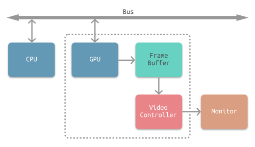
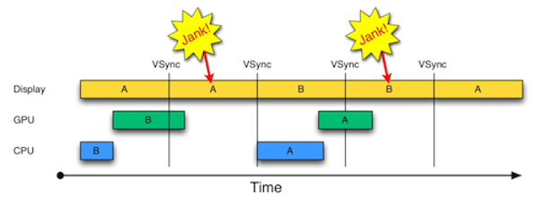
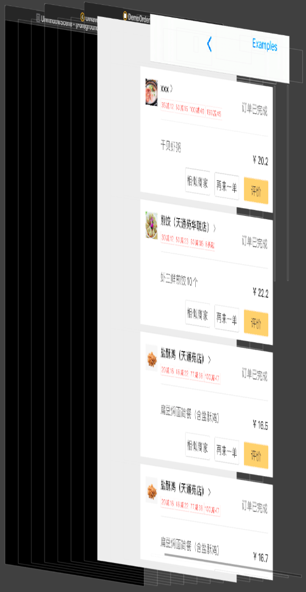
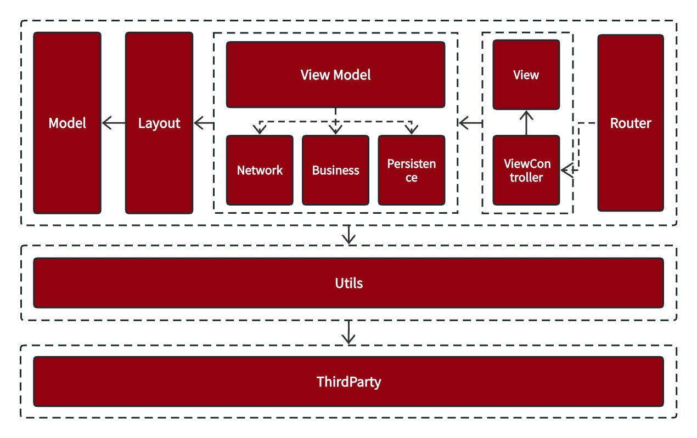

### 原理

#### 图像渲染原理

通常计算机屏幕显示是CPU与GPU协同合作完成一次渲染，如下图所示：



每个部分的工作解释如下：

\* CPU: 计算视图frame，图片解码，需要绘制纹理图片通过数据总线交给GPU

\* GPU: 纹理混合，顶点变换与计算,像素点的填充计算，渲染到帧缓冲区。

\* 时钟信号：垂直同步信号V-Sync/水平同步信号H-Sync。

\* iOS设备双缓冲机制：显示系统通常会引入两个帧缓冲区，也就是双缓冲机制。

渲染流程如图所示：

1. CPU将要显示的图形通过frame计算、图片解码等处理后将需要绘制的纹理图形数据通过总线BUS提交至GPU，
2. GPU经过对图像的纹理混合、顶点变换与计算、像素点的填充计算等处理后转化为一帧帧的数据并提交至帧缓冲区，
3. iOS采用双缓冲机制，GPU会预先渲染一帧放入一个缓冲区中，用于视频控制器的读取。当下一帧渲染完毕后，GPU会直接把视频控制器的指针指向第二个缓冲器，如下图所示：


4. 视频控制器会通过垂直同步信号VSync逐帧读取帧缓冲区的数据并提交至屏幕控制器最终显示在屏幕上。

#### 卡顿的产生



在显示系统的VSync信号到来后，系统图形服务会通知App，App主线程开始在CPU中计算显示内容，比如视图的创建、布局计算、图片解码、文本绘制等。随后CPU会将计算好的内容提交到GPU，由GPU进行变换、合成、渲染。随后GPU会把渲染结果提交到帧缓冲区去，等待下一次VSync信号到来时显示到屏幕上。由于垂直同步的机制，如果在一个VSync时间内，CPU或者GPU没有完成内容提交，则那一帧就会被丢弃，等待下一次机会再显示，而这时显示屏会保留之前的内容不变。这就是界面卡顿的原因。

##### CPU的消耗

布局计算：视图布局计算是应用最为常见的消耗CPU资源的地方，其最终实现都会通过UIView.frame/bounds/center等属性的调整上。

文本计算：文本宽高计算会占用很大一部分资源，并且不可避免。

文本渲染：屏幕上能看到的所有文本内容控件，包括UIWebView，在底层都是通过CoreText排版、绘制为Bitmap显示。常见的文本控件，如UILabel、UITextView等，其排版和绘制都是在主线程进行，当显示大量文本时，CPU的压力会非常大。

图像绘制：图像的绘制通常是指用CGxx开头的方法将图像绘制到画布中，然后从画布创建图片并显示这样的一个过程。

##### GPU的消耗

###### 纹理渲染

所有的Bitmap，包括图片、文本、栅格化的内容，最终都要从内存提交到显存，绑定为GPU纹理。不论是提交到显存的过程，还是GPU调制和渲染纹理的过程，都要消耗不少GPU资源。当在较短时间内显示大量图片时，CPU占用率很低，GPU占用非常高，因此会导致界面掉帧卡顿。

###### 视图混合

在多视图且多层次重叠显示时，GPU会首先将其混合在一起。如果视图结构很复杂，混合的过程也会消耗很多的GPU资源。

###### 屏幕渲染：

GPU屏幕渲染存在两种方式：当前屏幕渲染(On-Screen Rendering)和离屏渲染(Off-Screen Rendering)，其中当前屏幕渲染就是正常的GPU渲染流程，GPU将渲染完成的帧放到帧缓冲区，然后显示到屏幕；而离屏渲染会额外创建一个离屏渲染缓冲区(如保存后续复用的数据)，后续仍会提交至帧缓冲区进而显示到屏幕。

离屏渲染需要创建新的缓冲区，渲染过程中会涉及从当前屏幕切换到离屏环境多次上下文环境切换，等到离屏渲染完成后还需要将渲染结果切换到当前屏幕环境，因此付出的代价较高。

CALayer的border、圆角、阴影、遮罩(mask)，CASharpLayer的矢量图形显示，通常会触发离屏渲染(offscreen rendering)，而离屏渲染通常发生在GPU中。当一个列表视图中存在大量圆角的CALayer且款式滑动时，会消耗大量的GPU资源，进而引发界面卡顿。

### 卡顿优化方案的选择

从上文卡顿产生的原因我们可以发现，如果想要减少卡顿就需要减轻CPU以及GPU的压力。

我们参考了现有对于卡顿优化的方案，比较主流的有：Graver和Texture (AsyncDisplayKit)。

#### Graver

Graver是美团18年底开源的iOS异步渲染框架，由于某些争议的原因Graver取消了开源，不过可以通过fork过的仓库可以找到（[https://github.com/Nicholas86/Graver](https://github.com/Nicholas86/Graver)）

Graver的基本思路就是从“拼控件”到“画控件”，Graver的每个绘制元素通过WMMutableAttributedItem来表达内容信息、渲染信息，CGRect 表达绘制元素的大小和位置。渲染整个过程除画板视图外，完全没有使用 UIKit 控件，最终产出的结果是一张位图（Bitmap）。如果能通过一棵树形结构组织所有的绘制元素即绘制结点树，即可按照递归遍历的方式“画控件”来转义“拼控件”构建视图。效果如图所示：



从图中我们开看到Graver把每个cell都以一张位图的形式进行展现。

优点：

\* 性能：Graver有效提升空闲CPU的资源利用率，降低峰值CPU的占用率

\* 异步化：Graver从文本计算、样式排版渲染、图片解码，再到绘制，实现了全程异步化，并且是线程安全的

\* 性能消耗的“边际成本”低：Graver渲染整个过程除画板视图外完全没有使用 UIKit 控件，最终产出的结果是一张位图（Bitmap），视图层级、数量大幅降低

\* 渲染速度快：Graver并发进行多个画板视图的渲染、显示工作。得益于图文混排技术的应用，达到了内存占用低，渲染速度快的效果。

缺点：

\* 灵活性：Graver通过将所有子视图/图层压扁的形式来减少图层的层级，比较适用于静态内容渲染的场景，但失去了视图/图层树，也相应就失去了树形结构的灵活性。

\* 复杂性：由于视图最终通过渲染位图来呈现，这就需要建立基于位图的事件处理系统；动效等无法依托Graver进行图文渲染，需要考虑跨渲染引擎融合。

\* 维护性：由于Graver以不再开源后期维护成本较高

#### Texture (AsyncDisplayKit)

[Texture \(AsyncDisplayKit\)](https://github.com/facebookarchive/AsyncDisplayKit)是2012年由Facebook开始着手开发，并于2014年出品的高性能显示类库，主要作者是Scott Goodson。

Texture的基本思路就是异步：我们知道对于一般UIView和CALayer来说，因为不是线程安全的，任何相关操作都需要在主线程进行。Texture引入了Node的概念来解决UIView/CALayer只能在主线程上操作的限制。Texture需要创建UIView时替换成对应的Node来获取性能提升。

优点：

\* 性能：由于ASDisplayNode的显示是异步的，因此可以在主线程以外进行，并且有缓存，性能有很大提升。

\* 维护性：由于ASDK是开源的，调试难度大大降低。

缺点：

\* 学习曲线陡峭：Texture由于大量原本熟悉的操作变成异步，对于一个团队来说学习曲线也较为陡峭。

\* 现有业务改造工作量大：Texture对于现有代码改动较大，侵入性较高。Texture使用的是Flex布局如果想对已有的view改造成用Flexbox进行布局，需要重新使用ASDisplayNode来实现该view。

#### 方案的选择

经过上述对Graver和Texture(AsyncDisplayKit)两种主流方案的研究，结合我们现有的业务无法接入这两种方案。原因如下：

\* 由于Graver以无法持续维护，以及依然有较多的限制性的问题，导致接入后期的风险及不可控过高

\* 由于我们App信息流是基于现有业务进行优化改造，接入Texture会使开发成本成倍增长。

基于上述原因，我们决定借鉴这两种方案的异步渲染思想对我们App信息流做优化。

### 优化实践

我们App现有的信息流在多场景多业务中都有使用，我们发现现有的业务代码在一些低端设备上会出现卡顿现象，为了解决卡顿的问题，我们对信息流做了以下优化。

#### 预排版

我们针对信息流的业务场景，同时结合MVVM架构模式，衍生出适合我们App信息流的架构模式。我们在原有的MVVM架构模式插入了Layout层用于存储信息流中的布局信息，如下图所示：



ThirtyParty：主要包含第三方pod库以及我们自己下沉的脱离了业务的本地开发库

Utils: 主要是一些工具类

Router：路由跳转

ViewController&View：用于信息的展示

ViewModel：用于网络请求，业务数据处理、持久化以及信息流中布局布局元素的计算等

Layout：用于展示的布局信息，比如cell的宽高、渲染信息、模型数据等；

Model：业务数据模型

信息流涉及多个线程交互，整体流程如下：

\* 主线程构建请求参数，创建请求任务并放入网络线程队列中，发起网络请求。

\* 网络线程向后端服务发起请求，获得对应的信息流模型数据。

\* 网络请求获得信息流数据模型后，将其交由并行队列进行预排版，其中包含布局、渲染信息的排版模型。解析结束后，通知主线程排版完成。

\* 主线程获取排版模型后，随即触发信息流的重载。相对不同的排版信息交由生成对应的Cell，并进行数据的显示。

#### 异步渲染

##### 文本的异步渲染

为了避免重复造轮子，我们采用YYLabel的异步渲染机制，对于信息流中的文本进行异步绘制。异步渲染机制核心代码如下：

```objective-c
- (void)display {

    dispatch_async(YYAsyncLayerGetDisplayQueue(), ^{
        if (isCancelled()) {
            CGColorRelease(backgroundColor);
            return;
        }

        UIGraphicsBeginImageContextWithOptions(size, opaque, scale);
        CGContextRef context = UIGraphicsGetCurrentContext();

        .....

        UIImage *image = UIGraphicsGetImageFromCurrentImageContext();
        UIGraphicsEndImageContext();
        .....

            dispatch_async(dispatch_get_main_queue(), ^{

                self.contents = (__bridge id)(image.CGImage);

                if (task.didDisplay) task.didDisplay(self, YES);

            });
    });
}
```

##### 图片的异步渲染

图片文件被加载就必须要进行解码，解码过程是一个相当复杂的任务，需要消耗CPU非常长的时间。当使用UIImage或CGImageSource的那几个方法创建图片时，图片数据并不会立即解码。只有图片设置到UIImageView或者CALayer.contents中去，并且CALayer被提交到GPU前，CGImage中的数据才会得到解码，且需要在主线程执行。因此我们对图片解码过程做了异步处理。

对于网络图片或者本地图片的异步渲染核心代码如下：

```objective-c
- (void)display {

    ......

        dispatch_async(backgroudQueu, ^{

            CGContextRef context = CGBitmapContextCreate(...);

            //draw in context ....

            CGImageRef img = CGBitmapContextCreateImage(context);

            CFRelease(context);

            dispatch_async(mainQueue, ^{

                layer.contents = img;

            });

        });

}
```


#### 视图层级优化

为了减轻GPU的消耗，我们对Cell中的视图层级做了优化。

\* 减少冗余视图控件：删除Cell中不必要的视图控件。

\* 视图合并：将视图中小的icon和文本使用NSAttributedString合并成一个视图控件来达到减少视图层级的目的。

\* 预排版机制：利用预排版的机制提前将TextLayout计算并缓存在内存中，以便在显示时可以直接使用以及避免了重复绘制的问题。

\* 使用轻量级视图：使用相对于UIView更轻量级的CALayer来替代原有的UIView进行显示。例如我们将Cell的原UIImageView实现的渐变蒙层替换成CALayer来进行代码实现。

#### 离屏渲染优化

为了避免产生离屏渲染，我们对Cell中的视图做了以下优化：

\* cornerRadius优化：我们使用CAShapeLayer+UIBezierPath绘制圆角来实现圆角的绘制。

\* shadow优化：我们弃用了原有普遍使用的shadow设置的方法，转而使用shadowPath去设置阴影

\* 图片的优化：我们弃用了原UIImageView对圆角的处理，转而将网络图片预处理成带有圆角的图片，然后进行显示。

下图为优化前后，离屏渲染对比效果。从图中我们可以看到，经过上述优化，我们完全避免了信息流的离屏渲染。

### 总结

经过上述的优化，我们在降低信息流卡顿率上收获到了一定的效果。通过对比性能较差的iPhone7和iPad Air及以下机型上的信息流显示帧率，我们进行了优化前后的对比。在优化前，信息流的显示帧率在35～45FPS之间，而经过优化后，信息流的显示帧率得到显著提升，达到了55～60FPS。

#### 经验总结

以上都是结合我们App信息流业务卡顿制定的方案，因此，我们也从实践中总结出一些如何避免卡顿的的方案，如下所示：

1. 预排版：在显示之前可以通过将信息流中的数据提前在并行队列中进行计算布局，最后提交主线程进行显示。
2. 异步渲染：可以将文本和图片在将内容提交给layer.contents之前交给并行队列处理，最后交由主线程进行显示。
3. 视图层级缩减：可以通过减少、合并视图来达到缩减视图层级的目的。
4. 使用轻量级的视图：尽量使用CALayer替代UIView。
5. 避免离屏渲染：通过对cornerRadius、shadow、圆角的优化来避免产生离屏渲染。

以上是我们App对卡顿优化的一些经验总结，希望能为iOS开发者在卡顿优化的实践中带来一些启发。iOS的卡顿优化是一个复杂且艰巨的任务，它涉及到代码的重构、逻辑的重写、底层组件的改动，在优化的同时，还必须要保障业务逻辑的正常和稳定。
