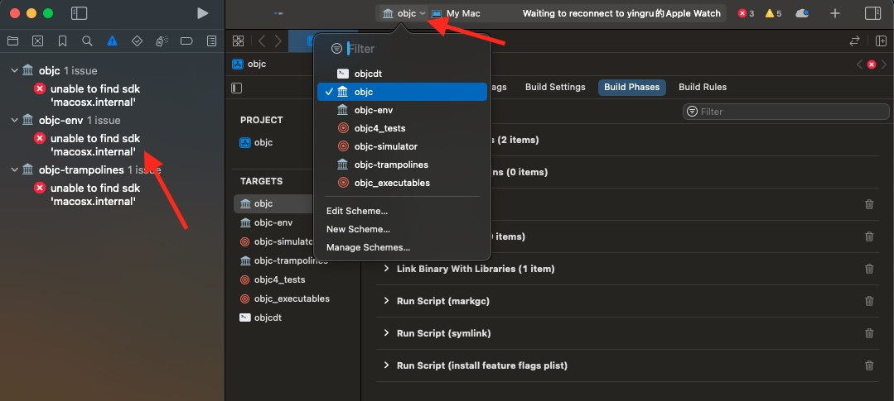

### 背景
随着macOS升级到Sonoma，Xcode升级到15.0+以后，之前的objc4-866运行调试之后就出现了Crash，无法进行正常的调试。苹果在2023年9月更新了objc4-906版本，因此便针对目前的编译环境配置了一版可编译调试工程。文末附有可以编译调试版本链接。
### 编译调试环境
本文基于目前手头设备进行的编译调试，如果不符合下述条件，可能会出现无法正常编译调试的情况。

* M芯片(本机M1 Pro)
* macOS Sonoma (14.1)
* Xcode 15.0+
### 源码下载

* [Objc4-906.2](https://github.com/apple-oss-distributions/objc4)
* [Xun-10002.1.13](https://github.com/apple-oss-distributions/xnu)
* [dyld-1125](https://github.com/apple-oss-distributions/dyld)
* [libplatform-306](https://github.com/apple-oss-distributions/libplatform)
* [libpthread-519](https://github.com/apple-oss-distributions/libpthread)
* [Libc-825.40.1](https://github.com/apple-oss-distributions/Libc/archive/refs/tags/Libc-825.40.1.zip)
* [Libc-1583.0.14](https://github.com/apple-oss-distributions/Libc)
* [libclosure-90](https://github.com/apple-oss-distributions/libclosure)
* [libdispatch-1462](https://github.com/apple-oss-distributions/libdispatch)

### 修改工程配置
#### 修改Base SDK
打开objc4工程，然后打开objc.xcodeproj。然后选择objc这target编译一下。可以看到报错如下。

在Project->build setting->Base SDK，选择 macOS。依次对objc-evn和objc-trampolines进行修改


#### 修改Run Script
修改objc target的Run Script(markgc)脚本，将 macosx.internal 改成macosx。
```
set -x
/usr/bin/xcrun -sdk macosx clang++ -Wall -mmacosx-version-min=10.12 -arch x86_64 -std=c++11 "${SRCROOT}/markgc.cpp" -o "${BUILT_PRODUCTS_DIR}/markgc"
"${BUILT_PRODUCTS_DIR}/markgc" "${BUILT_PRODUCTS_DIR}/libobjc.A.dylib"
```

### 补充缺失文件
再次编译objc，发现错误提示有些.h文件无法找到，首先在objc4工程根目录下新建一个目录，文件名随便，我这里就叫dependency，然后在Build Settings -> Header Search Paths中添加此路径"$(SRCROOT)/dependency"，如图所示


1.'sys/reason.h' file not found
打开下载的xun文件夹，然后在xnu/bsd/sys/目录下找到reason.h文件，copy到 dependency/sys/文件夹中（没有就新建）

2.'mach-o/dyld_priv.h' file not found
打开下载的dyld文件夹，在dyld/include/mach-o目录下找到 dyld_priv.h，copy到dependency/mach-o/目录下

3.'os/lock_private.h' file not found
在libplatform/private/os/找到 lock_private.h，copy到dependency/os/目录下

4.'os/base_private.h' file not found
在xun/libkern/os/找到 base_private.h，copy到dependency/os/

5.'pthread/tsd_private.h' file not found
在libpthread/private/pthread/目录下找到tsd_private.h，copy到dependency/pthread/

6.'machine/cpu_capabilities.h' file not found
在xnu/osfmk/machine/目录下找到 cpu_capabilities.h, copy到dependency/machine/

7.'os/tsd.h' file not found
在xnu/libsyscall/os/目录下找到 tsd.h, copy到dependency/os/

8.'System/pthread_machdep.h' file not found
在Libc-825.40.1/pthreads/目录下找到 pthread_machdep.h, copy到dependency/System/

9.'System/machine/cpu_capabilities.h' file not found
在xnu/osfmk/machine/ 目录下找到 cpu_capabilities.h, copy到 dependency/System/machine/

10.'os/variant_private.h' file not found
在Libc/os/目录下找到 variant_private.h，copy到dependency/os/

11.'pthread/spinlock_private.h' file not found
在libpthread/private/pthread/目录下找到spinlock_private.h，copy到dependency/pthread/

12.'objc-shared-cache.h' file not found
在 dyld/include/ 目录下找到 objc-shared-cache.h，copy 到 dependency/

13.'os/linker_set.h' file not found
在 xnu/bsd/sys/ 目录下找到 linker_set.h，copy 到 dependency/os/

14.'_simple.h' file not found
在 libclosure/ 目录下找到 Block_private.h，copy到dependency/

15.'kern/restartable.h' file not found
在 xnu/osfmk/kern/ 目录下找到 restartable.h，copy 到 copy到dependency/kern/

16.'os/reason_private.h' file not found
在 xnu/libkern/os/ 目录下找到 reason_private.h，copy 到 dependency/os/

17.'os/variant_private.h' file not found
在 Libc/os/ 目录下找到 variant_private.h，copy 到 dependency/os/

### 修复编译错误
1.'os/feature_private.h' file not found
直接注释此头文件的引用

2.dyld_priv.h中，error: expected ',' extern bool dyld_sdk_at_least(const struct mach_header* mh, dyld_build_version_t version) __API_AVAILABLE(macos(10.14), ios(12.0), watchos(5.0), tvos(12.0), bridgeos(3.0));
删除dyld_priv.h的所有的bridgeos(3.0)，包括前面的','号。

3.lock_private.h 中 error: expected ',' tvos(13.0), watchos(6.0), bridgeos(4.0)) = 0x00040000
删除bridgeos(4.0)

4.variant_private.h 文件中报 error: expected ',' API_AVAILABLE(macosx(10.16)) API_UNAVAILABLE(ios, tvos, watchos, bridgeos)
OS_EXPORT OS_WARN_RESULT
删除variant_private.h中所有的bridgeos(4.0)以及bridgeos相关内容

5.os/lock_private.h:34:1 '#pragma clang assume_nonnull' was not ended within this file
注释掉OS_ASSUME_NONNULL_BEGIN

6./Users/doctorgg/Documents/技术/objc4/objc4-906/objc4-main/dependency/os/lock_private.h:579:2 Embedding a #include directive within macro arguments is not supported

7.Use of undeclared identifier 'dyld_platform_version_macOS_10_13'
直接注释掉该处代码：
```objc
        if (!dyld_program_sdk_at_least(dyld_platform_version_macOS_10_13)) {
            DisableInitializeForkSafety = On;
            if (PrintInitializing) {
                _objc_inform("INITIALIZE: disabling +initialize fork "
                             "safety enforcement because the app is "
                             "too old.)");
            }
        }
```

8.Use of undeclared identifier 'dyld_fall_2020_os_versions'
直接注释掉相关代码即可


9.'sandbox/private.h' file not found
直接注释掉相关引用即可


10.Use of undeclared identifier 'CRGetCrashLogMessage'
直接注释相关代码即可


11.Use of undeclared identifier 'SANDBOX_FILTER_PATH'
直接注释相关代码即可


12.'Cambria/Traps.h' file not found
直接注释掉引用


13.'Cambria/Cambria.h' file not found
直接注释掉引用


14.Use of undeclared identifier 'oah_is_current_process_translated'
直接注释相关代码，如下
```
// 修改前
        if (oah_is_current_process_translated()) {
            kern_return_t ret = objc_thread_get_rip(threads[count], (uint64_t*)&pc);
            if (ret != KERN_SUCCESS) {
                pc = PC_SENTINEL;
            }
        } else {
            pc = _get_pc_for_thread (threads[count]);
        }
        
// 修改后
pc = _get_pc_for_thread (threads[count]);
```

15.Use of undeclared identifier 'objc4'
注释掉相关代码：
```
    if (!os_feature_enabled_simple(objc4, preoptimizedCaches, true)) {
        DisablePreoptCaches = On;
    }
```

16.Use of undeclared identifier 'dyld_platform_version_macOS_10_11'
注释掉相关代码：
```
        if (dyld_get_active_platform() == PLATFORM_MACOS && !dyld_program_sdk_at_least(dyld_platform_version_macOS_10_11)) {
            DisableNonpointerIsa = On;
            if (PrintRawIsa) {
                _objc_inform("RAW ISA: disabling non-pointer isa because "
                             "the app is too old.");
            }
        }
```

17.'_static_assert' declared as an array with a negative size
注释掉相关代码
```
STATIC_ASSERT((~ISA_MASK & OBJC_VM_MAX_ADDRESS) == 0  ||
              ISA_MASK + sizeof(void*) == OBJC_VM_MAX_ADDRESS);
```

18.Use of undeclared identifier 'dyld_fall_2018_os_versions'
注释掉相关引用


19.'os/feature_private.h' file not found
注释掉相关引用


20.'os/log_simple_private.h' file not found
注释掉相关引用


21.Use of undeclared identifier 'os_log_simple'
注释掉相关代码
```
    os_log_simple("Large Autorelease Pool");
```

22.Use of undeclared identifier 'dyld_platform_version_bridgeOS_2_0'，Use of undeclared identifier 'dyld_platform_version_iOS_10_0'，Use of undeclared identifier 'dyld_platform_version_macOS_10_12'，Use of undeclared identifier 'dyld_platform_version_tvOS_10_0'，Use of undeclared identifier 'dyld_platform_version_watchOS_3_0'
直接修改此段代码中的sdkIsAtLeast的使用
```
// 修改前
        bool willTerminate = (DebugPoolAllocation == Fatal
                              || sdkIsAtLeast(10_12, 10_0, 10_0, 3_0, 2_0));
                              
// 修改后
        bool willTerminate = (DebugPoolAllocation == Fatal);
```

23.library not found for -lCrashReporterClient
在 objc 这个 target 的 Build Settings 中，搜索Other Linker Flags，然后在其中删除-lCrashReporterClient


24.library not found for -loah
在 objc 这个 target 的 Build Settings 中，搜索 Other Linker Flags，然后在其中删除 -loah

Nice！！！编译成功

### 创建调试target
在编译成功以后，添加一个可供调试的target。如图所示
接着添加依赖库

### 可调试源码
文章最后附上可调试源码：[https://github.com/MrOwlSage/objc4-906](https://github.com/MrOwlSage/objc4-906)
