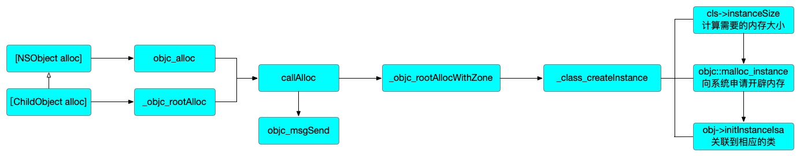

### 引言

在我们日常开发工程中，alloc`方法在iOS开发中扮演着非常重要的角色，它为对象分配内存空间，还将对象关联到对应的类。本文将基于最新的[objc4-906](https://mrowlsage.github.io/posts/objc4-906-debug/)，对alloc的底层实现进行探索研究。

### 源码流程解析

在[objc4-906](https://mrowlsage.github.io/posts/objc4-906-debug/)工程中声明一个GGObject，代码如下：

```objective-c
@interface GGObject : NSObject
@property (nonatomic, assign) NSInteger age;
@end

@implementation GGObject

@end

int main(int argc, const char * argv[]) {
  @autoreleasepool {
    // insert code here...
    GGObject *obj = [GGObject alloc];
  }
  return 0;
}
```

利用断点跟踪[GGObject alloc]，alloc底层调用流程如下：

```objective-c
+ (id)alloc {
    return _objc_rootAlloc(self);
}

// Base class implementation of +alloc. cls is not nil.
// Calls [cls allocWithZone:nil].
id
_objc_rootAlloc(Class cls)
{
    return callAlloc(cls, false/*checkNil*/, true/*allocWithZone*/);
}

// Call [cls alloc] or [cls allocWithZone:nil], with appropriate
// shortcutting optimizations.
static ALWAYS_INLINE id
callAlloc(Class cls, bool checkNil, bool allocWithZone=false)
{
    if (slowpath(checkNil && !cls)) return nil;
    if (fastpath(!cls->ISA()->hasCustomAWZ())) {
        return _objc_rootAllocWithZone(cls, nil);
    }

    // No shortcuts available.
    if (allocWithZone) {
        return ((id(*)(id, SEL, struct _NSZone *))objc_msgSend)(cls, @selector(allocWithZone:), nil);
    }
    return ((id(*)(id, SEL))objc_msgSend)(cls, @selector(alloc));
}

id
_objc_rootAllocWithZone(Class cls, objc_zone_t)
{
    // allocWithZone under __OBJC2__ ignores the zone parameter
    return _class_createInstance(cls, 0, OBJECT_CONSTRUCT_CALL_BADALLOC);
}

/***********************************************************************
* class_createInstance
* fixme
* Locking: none
*
* Note: this function has been carefully written so that the fastpath
* takes no branch.
**********************************************************************/
static ALWAYS_INLINE id
_class_createInstance(Class cls, size_t extraBytes,
                      int construct_flags = OBJECT_CONSTRUCT_NONE,
                      bool cxxConstruct = true,
                      size_t *outAllocatedSize = nil)
{
    ASSERT(cls->isRealized());

    // Read class's info bits all at once for performance
    bool hasCxxCtor = cxxConstruct && cls->hasCxxCtor();
    bool hasCxxDtor = cls->hasCxxDtor();
    bool fast = cls->canAllocNonpointer();
    size_t size;

    // 先计算需要的内存空间大小
    size = cls->instanceSize(extraBytes);
    if (outAllocatedSize) *outAllocatedSize = size;

    // 向系统申请开辟内存，返回地址指针
    id obj = objc::malloc_instance(size, cls);
    if (slowpath(!obj)) {
        if (construct_flags & OBJECT_CONSTRUCT_CALL_BADALLOC) {
            return _objc_callBadAllocHandler(cls);
        }
        return nil;
    }

    if (fast) {
        // 将对象和对应类进行绑定
        obj->initInstanceIsa(cls, hasCxxDtor);
    } else {
        // Use raw pointer isa on the assumption that they might be
        // doing something weird with the zone or RR.
        obj->initIsa(cls);
    }

    if (fastpath(!hasCxxCtor)) {
        return obj;
    }

    construct_flags |= OBJECT_CONSTRUCT_FREE_ONFAILURE;
    return object_cxxConstructFromClass(obj, cls, construct_flags);
}
```

上述代码即为alloc调用的主要流程，其中对fastpath()以及slowpath()进行一下说明，其两个的宏定义如下

```objective-c
#define fastpath(x) (__builtin_expect(bool(x), 1))  // __builtin_expect((x),1) 表示 x 的值为真的可能性更大；
#define slowpath(x) (__builtin_expect(bool(x), 0))  // __builtin_expect((x),0) 表示 x 的值为假的可能性更大。
```

fastpath(x)表示 x 的值为真的可能性更大；slowpath(x)表示 x 的值为假的可能性更大。if(fastpath(x))) 等价于 if(value)；if(slowpath(value)) 也等价于 if(value)。可以理解为加了这个关键字，判断效果和以前一直，只是告诉编译器，哪个是大概率发生的，预装载，提高cpu效率
__builtin_expect() 是 GCC (version >= 2.96）提供给程序员使用的，目的是将“分支转移”的信息提供给编译器，这样编译器可以对代码进行优化，以减少指令跳转带来的性能下降。

需要特别声明一下，当我们调用[NSObject alloc]的时候，根据断点跟踪，并没有调用+ (id)alloc方法，而是直接调用了id objc_alloc(Class cls)这个方法。代码如下

```objective-c
+ (id)alloc {
    return _objc_rootAlloc(self);
}

// [NSObject alloc]真正的调用
// Calls [cls alloc].
id
objc_alloc(Class cls)
{
    return callAlloc(cls, true/*checkNil*/, false/*allocWithZone*/);
}
```

然而为什么会是这样的一个逻辑，就需要追述到底层llvm所做的操作，llvm中的代码如下：

```c++
static Optional<llvm::Value *>
tryGenerateSpecializedMessageSend(CodeGenFunction &CGF, QualType ResultType,
                                  llvm::Value *Receiver,
                                  const CallArgList& Args, Selector Sel,
                                  const ObjCMethodDecl *method,
                                  bool isClassMessage) {
.......
  switch (Sel.getMethodFamily()) {
  case OMF_alloc:
    if (isClassMessage &&
        Runtime.shouldUseRuntimeFunctionsForAlloc() &&
        ResultType->isObjCObjectPointerType()) {
        // [Foo alloc] -> objc_alloc(Foo) or
        // [self alloc] -> objc_alloc(self)
        if (Sel.isUnarySelector() && Sel.getNameForSlot(0) == "alloc")
          return CGF.EmitObjCAlloc(Receiver, CGF.ConvertType(ResultType));
        // [Foo allocWithZone:nil] -> objc_allocWithZone(Foo) or
        // [self allocWithZone:nil] -> objc_allocWithZone(self)
        if (Sel.isKeywordSelector() && Sel.getNumArgs() == 1 &&
            Args.size() == 1 && Args.front().getType()->isPointerType() &&
            Sel.getNameForSlot(0) == "allocWithZone") {
          const llvm::Value* arg = Args.front().getKnownRValue().getScalarVal();
          if (isa<llvm::ConstantPointerNull>(arg))
            return CGF.EmitObjCAllocWithZone(Receiver,
                                             CGF.ConvertType(ResultType));
          return None;
        }
    }
    break;
	......
  default:
    break;
  }
  return None;
}

/// Allocate the given objc object.
///   call i8* \@objc_alloc(i8* %value)
llvm::Value *CodeGenFunction::EmitObjCAlloc(llvm::Value *value,
                                            llvm::Type *resultType) {
  return emitObjCValueOperation(*this, value, resultType,
                                CGM.getObjCEntrypoints().objc_alloc,
                                "objc_alloc");
}
```

从llvm的代码中我们可以看到对其进行了优化，这也解释了为什么NSObject会调用objc_alloc这个方法id objc_alloc(Class cls)。通过上面的代码流程可以梳理出alloc的底层实现逻辑如图所示：



### 对象alloc内存大小

#### 底层分析alloc对象大小的原因

利用代码查看alloc一个对象的过程中，占用内存的情况是什么样子的，代码如下：

```objc
GGObject *obj = [GGObject alloc];
NSLog(@"%d, %d, %d", sizeof(obj), class_getInstanceSize([GGObject class]), malloc_size((__bridge const void *)(obj)));
/// 输出结果：8, 16, 16
```

`sizeof()`是C语言中的一个运算符，用于获取数据类型或变量所占用的字节数。它是在编译时计算大小，并且只能用于静态类型，无法用于动态分配的内存块。`sizeof()`计算的是类型的大小，而不是变量的大小。

`class_getInstanceSize()`是Objective-C运行时库中的一个函数，用于获取指定类的实例对象所占用的内存大小。它是在运行时计算大小，并且可以用于动态分配的内存块。`class_getInstanceSize()`计算的是实例对象的大小，不包括类所继承的父类的大小。

`malloc_size()`是一个C函数，用于获取通过`malloc()`函数分配的内存块的大小。它返回的是分配的内存块的总大小，包括实际分配的内存和用于管理内存的元数据。

为什么sizeof(obj)和class_getInstanceSize([GGObject class])两个所得到结果会不一样呢，让我们从源码入手进行分析。利用clang -rewrite-objc main.m -o main.cpp将代码转化为C++代码如下：

```objective-c
struct GGObject_IMPL {
    struct NSObject_IMPL NSObject_IVARS;
};

struct NSObject_IMPL {
    Class isa;
};

typedef struct objc_class *Class;
```

通过上述代码会发现GGObject和NSObject的底层实现都是结构体，sizeof()是对GGObject_IMPL这个结构体的静态类型进行计算，GGObject_IMPL内部只有NSObject_IMPL结构体，NSObject_IMPL这个结构体中只有一个Class isa一个变量，而isa是一个结构体指针，它在哪从中只占8个字节，所以打印出来就是8。

在对象alloc的过程中会计算对象的大小底层代码如下：

```objc
    inline size_t instanceSize(size_t extraBytes) const {
        if (fastpath(cache.hasFastInstanceSize(extraBytes))) {
            // 大概率会走这
            return cache.fastInstanceSize(extraBytes);
        }

        size_t size = alignedInstanceSize() + extraBytes;
        // CF requires all objects be at least 16 bytes.
        if (size < 16) size = 16;
        return size;
    }

    size_t fastInstanceSize(size_t extra) const
    {
        ASSERT(hasFastInstanceSize(extra));

        if (__builtin_constant_p(extra) && extra == 0) {
            return _flags & FAST_CACHE_ALLOC_MASK16;
        } else {
            size_t size = _flags & FAST_CACHE_ALLOC_MASK;
            // remove the FAST_CACHE_ALLOC_DELTA16 that was added
            // by setFastInstanceSize
            return align16(size + extra - FAST_CACHE_ALLOC_DELTA16);
        }
    }
```

上述代码会强制将内存大小的计算进行16字节对齐，也就是小于16字节的也要进行16字节对齐，这也就是为什么class_getInstanceSize()会是16的原因。

#### 内存对齐原则

1. **内置类型数据成员**：结构（struct/class）的内置类型数据成员，第一个数据成员放在offset为0的地方，以后每个数据成员的起始位置要从自身大小的整数倍开始存储
2. **结构体作为成员**: 如果一个结构里有某些结构体成员，则结构体成员要从其内部“最宽基本类型成员”的整数倍地址开始存储（如struct a里存有struct b，b里有char, int, double等元素，那b应该从8的整数倍位置开始存储)。
3. **收尾工作**: 结构体的总大小，也就是sizeof的结果必须要对齐到内部"最宽基本类型成员"的整数倍，不足的要补齐。(基本类型不包括struct/class/union)。
4. **sizeof(union)** 以结构里面size最大的元素为union的大小，因为在某一时刻，union只有一个成员真正存储于该地址。

#### 内存对齐原因

1. 平台原因：不是所有的硬件平台都能访问任意地址上的任意数据的；某些硬件平台只能在某些地址处取某些特定类型的数据，否则抛出硬件异常。
2. 性能原因：经过内存对齐后，CPU的内存访问速度大大提升。

#### 不同类型内存占用

不同类型对内存的占用情况如下图所示：


