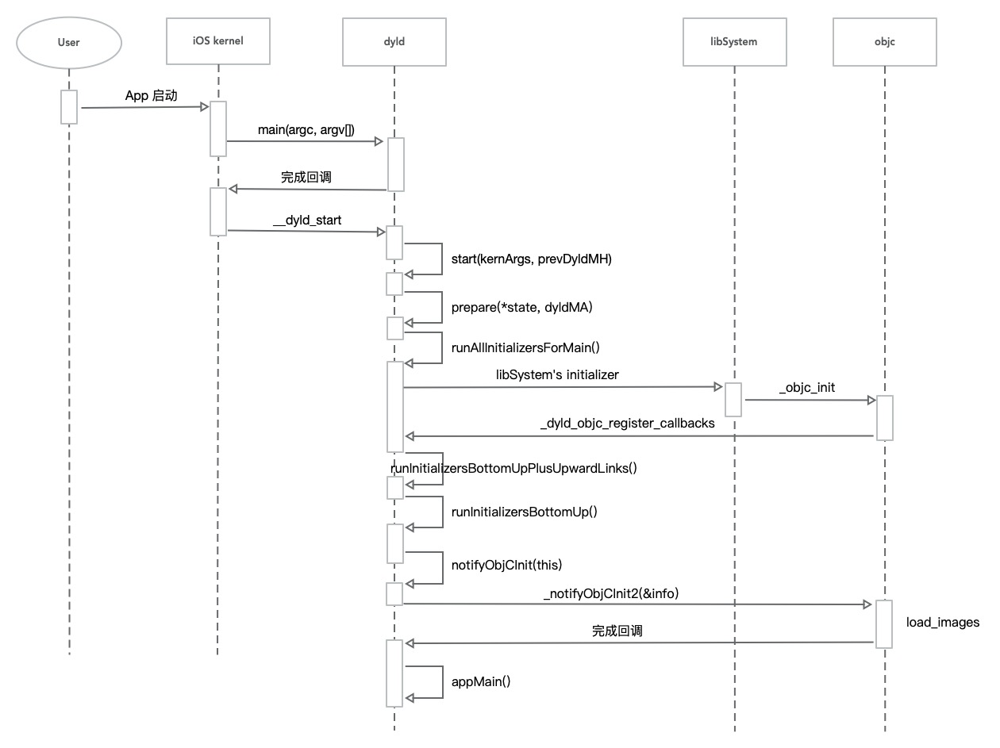

### 引言

当我们在iOS开发中运行一个应用时，系统会首先加载应用的可执行文件，然后执行dyld（动态链接器）的流程，完成动态链接和加载所需的动态库。本文将基于最新的[dyld-1125](https://github.com/apple-oss-distributions/dyld)，对dyld的加载流程进行探索研究。

### 源码编译流程

首先我们先来了解一下我们在编写OC代码后的整个编译流程是怎样的，如下图所示：


- 源代码：这是我们编写的代码，通常是.h、.m、.cpp等文件
- 预编译：主要是对源代码进行宏替换、删除注释、展开头文件、添加行号和文件名标识、保留所有的`#pragma`编译期指令，最终产生`.i`文件
- 编译：将`预编译`完的.i文件进行`词法分析`、`语义分析`及优化后输出汇编代码文件即`.s`文件
- 汇编：将`.s`文件转换为机器编码，生成`.o`文件
- 链接：将`.o`文件中对其他库的引用的地方进行引用，生成可执行文件

### dyld4流程分析

#### dyld4入口

我们都了解`main`函数是一个项目的入口，dyld4也不例外，我们从dyld4的`main`函数作为入口进行研究，由于main函数的代码较长，我们只摘取核心代码进行解读，源码如下：

```c++
// dyld_info.cpp
int main(int argc, const char* argv[])
{
.......// 一些容错判断
    bool                             validateOnly = false;
    PrintOptions                     printOptions;
    __block std::vector<std::string> files;
            std::vector<const char*> cmdLineArchs;
    for (int i=1; i < argc; ++i) {
        const char* arg = argv[i];
        if ( strcmp(arg, "-platform") == 0 ) {
            printOptions.platform = true;
        }
	.......  // 一些打印选项的设置
    }

    size_t cacheLen;
    __block const DyldSharedCache* dyldCache = (DyldSharedCache*)_dyld_get_shared_cache_range(&cacheLen);
    __block const char* currentArch = dyldCache->archName();
	// 从dyldCache中加载Mach-o
    for (const std::string& pathstr : files) {
        const char* path = pathstr.c_str();
        //fprintf(stderr, "doing: %s\n", path);
        Diagnostics diag;
        bool fromSharedCache = false;
        dyld3::closure::FileSystemPhysical fileSystem;
        dyld3::closure::LoadedFileInfo info;
        __block std::vector<const char*> archesForFile;
        char realerPath[MAXPATHLEN];

        __block bool printedError = false;
        void (^fileErrorLog)(const char *format, ...) __printflike(1, 2)
            = ^(const char *format, ...) __printflike(1, 2) {
                fprintf(stderr, "dyld_info: '%s' ", path);
                va_list list;
                va_start(list, format);
                vfprintf(stderr, format, list);
                va_end(list);
                fprintf(stderr, "\n");
                printedError = true;
            };

        if ( !fileSystem.loadFile(path, info, realerPath, fileErrorLog) ) {
            if ( printedError )
                continue;

#if SUPPORT_HOST_INTROSPECTION
            if ( strncmp(path, "/System/DriverKit/", 18) == 0 ) {
                dyld_for_each_installed_shared_cache(^(dyld_shared_cache_t cache) {
                    __block bool mainFile = true;
                    dyld_shared_cache_for_each_file(cache, ^(const char *file_path) {
                        // skip subcaches files
                        if ( !mainFile )
                            return;
                        mainFile = false;

                        if ( strncmp(file_path, "/System/DriverKit/", 18) != 0 )
                            return;

                        // skip caches for uneeded architectures
                        const char* found = strstr(file_path, currentArch);
                        if ( found == nullptr || strlen(found) != strlen(currentArch) )
                            return;

                        std::vector<const DyldSharedCache*> dyldCaches;
                        dyldCaches = DyldSharedCache::mapCacheFiles(file_path);
                        if ( dyldCaches.empty() )
                            return;
                        dyldCache = dyldCaches.front();
                    });
                });
            }
#endif

            // see if path is in current dyld shared cache
            info.fileContent = nullptr;
            if ( dyldCache != nullptr ) {
                uint32_t imageIndex;
                if ( dyldCache->hasImagePath(path, imageIndex) ) {
                    uint64_t mTime;
                    uint64_t inode;
                    const mach_header* mh = dyldCache->getIndexedImageEntry(imageIndex, mTime, inode);
                    info.fileContent = mh;
                    info.path = path;
                    fromSharedCache = true;
                    archesForFile.push_back(currentArch);
                }
            }

            if ( !fromSharedCache ) {
                fprintf(stderr, "dyld_info: '%s' file not found\n", path);
                continue;
            }
        }
    
        __block dyld3::Platform platform = dyld3::Platform::unknown;
        if ( dyld3::FatFile::isFatFile(info.fileContent) ) {
            const dyld3::FatFile* ff = (dyld3::FatFile*)info.fileContent;
            ff->forEachSlice(diag, info.fileContentLen, ^(uint32_t sliceCpuType, uint32_t sliceCpuSubType, const void* sliceStart, uint64_t sliceSize, bool& stop) {
                const char* sliceArchName = dyld3::MachOFile::archName(sliceCpuType, sliceCpuSubType);
                if ( cmdLineArchs.empty() || inStringVector(cmdLineArchs, sliceArchName) ) {
                    archesForFile.push_back(sliceArchName);
                    const dyld3::MachOFile* mf = (dyld3::MachOFile*)sliceStart;
                    mf->forEachSupportedPlatform(^(dyld3::Platform plat, uint32_t minOS, uint32_t sdk) {
                        if ( platform == dyld3::Platform::unknown)
                            platform = plat;
                    });
                }
            });
        }
        else if ( !fromSharedCache ) {
            const dyld3::MachOFile* mo = (dyld3::MachOFile*)info.fileContent;
            if ( mo->isMachO(diag, info.sliceLen) ) {
                archesForFile.push_back(mo->archName());
                mo->forEachSupportedPlatform(^(dyld3::Platform plat, uint32_t minOS, uint32_t sdk) {
                    if ( platform == dyld3::Platform::unknown)
                        platform = plat;
                });
            }
            else {
                if ( !diag.errorMessageContains("MH_MAGIC") || !validateOnly )
                    fprintf(stderr, "dyld_info: '%s' %s\n", path, diag.errorMessage());
                continue;
            }
        }
        if ( archesForFile.empty() ) {
            fprintf(stderr, "dyld_info: '%s' does not contain specified arch(s)\n", path);
            continue;
        }

		// 从本地路径加载Mach-o
        char loadedPath[MAXPATHLEN];
        for (const char* sliceArch : archesForFile) {
            if ( !fromSharedCache )
                info = dyld3::MachOAnalyzer::load(diag, fileSystem, path, dyld3::GradedArchs::forName(sliceArch), platform, loadedPath);
		......//打印设置选项
        }
    }
    return 0;
}
```

通过源码可以看出dyld4的`main`主要做了下面几件事：

- 设置打印选项
- 从dyld的共享内存中或者根据路径加载`Mach-o`，并存储在`dyld3::closure::LoadedFileInfo`的实例对象中
- 打印选项

#### App启动

我们的都知道在调用App的`main`函数之前，会提前执行`+(void)load`方法，因此我们依次作为切入点对dyld进行探索，我们在Test项目中对`+(void)load`进行断点，bt打印堆栈如下：

```objective-c
(lldb) bt
* thread #1, queue = 'com.apple.main-thread', stop reason = breakpoint 4.1
  * frame #0: 0x0000000104119820 test`+[Person load](self=Person, _cmd="load") at main.m:19:5
    frame #1: 0x0000000180043400 libobjc.A.dylib`load_images + 664
    frame #2: 0x0000000104823880 dyld_sim`dyld4::RuntimeState::notifyObjCInit(dyld4::Loader const*) + 304
    frame #3: 0x0000000104828c64 dyld_sim`dyld4::Loader::runInitializersBottomUp(dyld4::RuntimeState&, dyld3::Array<dyld4::Loader const*>&) const + 204
    frame #4: 0x000000010482b914 dyld_sim`dyld4::Loader::runInitializersBottomUpPlusUpwardLinks(dyld4::RuntimeState&) const::$_1::operator()() const + 92
    frame #5: 0x0000000104828dcc dyld_sim`dyld4::Loader::runInitializersBottomUpPlusUpwardLinks(dyld4::RuntimeState&) const + 272
    frame #6: 0x000000010483efd0 dyld_sim`dyld4::APIs::runAllInitializersForMain() + 268
    frame #7: 0x0000000104819f48 dyld_sim`dyld4::prepare(dyld4::APIs&, dyld3::MachOAnalyzer const*) + 1944
    frame #8: 0x00000001048193a0 dyld_sim`_dyld_sim_prepare + 928
    frame #9: 0x00000001043179b4 dyld`dyld4::prepareSim(dyld4::RuntimeState&, char const*) + 1204
    frame #10: 0x0000000104316424 dyld`dyld4::prepare(dyld4::APIs&, dyld3::MachOAnalyzer const*) + 252
    frame #11: 0x0000000104315edc dyld`start + 1844
```

通过堆栈信息，我们可以看到dyld首先调用的是`start`方法，于是我们将目光转向`start`方法，但是`start`方法又是如何被调用的呢？通过对[dyld-1125](https://github.com/apple-oss-distributions/dyld)代码分析后可以了解到，当iOS系统在启动一个App时，iOS内核会通过映射关系找到App的可执行文件和dyld，iOS内核启动进程，程序计数器设置为 dyld 中的 `__dyld_start`。此处可以参考代码中的注释：

```c++
// 文件名dyldStartup.s
/*
 * When starting a dynamic process, the kernel maps the main executable and dyld.
 * The kernel the starts the process with program counter set to __dyld_start
 * in dyld with the stack looking like:
 */
```

通过上面的注释我们将目光转向 `__dyld_start`，这是一段汇编代码：

```assembly
// 文件名dyldStartup.s
#if !TARGET_OS_SIMULATOR && !TARGET_OS_EXCLAVEKIT
    .text
    .align    4
    .globl __dyld_start
__dyld_start:
......
#elif __arm64__
    mov    x0, sp               // get pointer to KernelArgs into parameter register
    and    sp, x0, #~15         // force 16-byte alignment of stack
    mov    fp, #0               // first frame
    mov    lr, #0               // no return address
    b      start                // 调用start方法
#endif
......
#endif // !TARGET_OS_SIMULATOR
```

这段汇编代码的作用是对栈进行对齐，并跳转到`dyld::start(dyld4::KernelArgs*)`入口函数，这也是我们在bt打印堆栈时并未包含的堆栈信息。

#### start

```c++
// dyldMain.cpp
void start(KernelArgs* kernArgs, void* prevDyldMH)
{
	......//省略非主要代码
        
     // 获取MachO的解析器，同时进行rebase
    // walk all fixups chains and rebase dyld
    const MachOAnalyzer* dyldMA = getDyldMH();
    if ( !dyldMA->inDyldCache() )
        rebaseSelf(dyldMA);
    
	......//省略非主要代码
        
    // 在链接静态库之前做一些初始设置
    // Do any set up needed by any linked static libraries
    initializeLibc(kernArgs);

	......//省略非主要代码
    
    // Declare everything we need outside of the allocator scope
    Allocator*      allocator   = nullptr;
    APIs*           state       = nullptr;
    MainFunc        appMain     = nullptr;
    
    // 创建了一个名为bootStrapMemoryManager的内存管理器对象
    // 这段代码是一个初始化过程，它创建了一个内存管理器（MemoryManager）和一个分配器（Allocator），并使用这些对象来构建一些其他对象。
#if !TARGET_OS_EXCLAVEKIT
    MemoryManager bootStrapMemoryManager((const char**)kernArgs->findApple());
#else
    MemoryManager bootStrapMemoryManager;
#endif // !TARGET_OS_EXCLAVEKIT

    bootStrapMemoryManager.withWritableMemory([&] {
        EphemeralAllocator ephemeralAllocator;
        // Setup the persistent allocator
        allocator = &Allocator::persistentAllocator(std::move(bootStrapMemoryManager));
        
        // use placement new to construct ProcessConfig object in the Allocator pool
        ProcessConfig& config  = *new (allocator->aligned_alloc(alignof(ProcessConfig), sizeof(ProcessConfig))) ProcessConfig(kernArgs, sSyscallDelegate, *allocator);

        // create APIs (aka RuntimeState) object in the allocator
        state = new (allocator->aligned_alloc(alignof(APIs), sizeof(APIs))) APIs(config, locks, *allocator);

#if HAS_EXTERNAL_STATE
        // set initial state for ExternallyViewableState
        state->externallyViewable.init(state->persistentAllocator, ephemeralAllocator, state->fileManager, state->config.process.platform);
        // publish initial externally visible state that has main program and dyld
        setInitialExternallyVisibleState(*state, ephemeralAllocator, dyldMA);
#endif // HAS_EXTERNAL_STATE

        // *****在main函数调用之前的准备工作
        // *****此处为下面探索重点
        // load all dependents of program and bind them together
        appMain = prepare(*state, dyldMA);
    });

#if TARGET_OS_EXCLAVEKIT
    // inform liblibc_plat that all static initializers have run and let it finalize the process startup
    state->vars->finalize_process_startup(appMain);

    // if we get here, finalize_process_startup returned (it's not supposed to)
    halt("finalize_process_startup wrongly returned");
#else
    
    // *****main函数的调用
    // call main() and if it returns, call exit() with the result
    // Note: this is organized so that a backtrace in a program's main thread shows just "start" below "main"
    int result = appMain(state->config.process.argc, state->config.process.argv, state->config.process.envp, state->config.process.apple);

    // if we got here, main() returned (as opposed to program calling exit())
#if TARGET_OS_OSX && !TARGET_OS_EXCLAVEKIT
    // <rdar://74518676> libSystemHelpers is not set up for simulators, so directly call _exit()
    if ( MachOFile::isSimulatorPlatform(state->config.process.platform) )
        _exit(result);
#endif // TARGET_OS_OSX && !TARGET_OS_EXCLAVEKIT
    state->libSystemHelpers->exit(result);
#endif // TARGET_OS_EXCLAVEKIT
}
#endif // !TARGET_OS_SIMULATOR

} // namespace
```

`dyld::start(dyld4::KernelArgs*)`方法主要做了以下几件事：

- 对加载进来的MachO进行rebase
- 在链接静态库之前做一些初始设置
- 创建内存管理器以及分配器
- 在`main`函数之前的一些准备工作
- 调用`main`函数

#### prepare(APIs& state, const MachOAnalyzer* dyldMH)

```c++
// dyldMain.cpp
__attribute__((noinline)) static MainFunc prepare(APIs& state, const MachOAnalyzer* dyldMH)
{
	......省略非主要代码
	// *****初始化mainLoader
    Loader*                  mainLoader = nullptr;
#if SUPPORT_CREATING_PREBUILTLOADERS
    // check for pre-built Loader
    state.initializeClosureMode();
    const PrebuiltLoaderSet* mainSet    = state.processPrebuiltLoaderSet();
    if ( mainSet != nullptr ) {
        mainLoader = (Loader*)mainSet->atIndex(0);
        state.loaded.reserve(state.initialImageCount()); // help avoid reallocations of Vector
    }
#endif // SUPPORT_CREATING_PREBUILTLOADERS
    if ( mainLoader == nullptr ) {
        // if no pre-built Loader, make a just-in-time one
        state.loaded.reserve(512);  // guess starting point for Vector size
        Diagnostics buildDiag;
        mainLoader = JustInTimeLoader::makeLaunchLoader(buildDiag, state, state.config.process.mainExecutable,
                                                        state.config.process.mainExecutablePath, nullptr);
        if ( buildDiag.hasError() ) {
            state.log("%s in %s\n", buildDiag.errorMessage(), state.config.process.mainExecutablePath);
            halt(buildDiag.errorMessage(), &state.structuredError);
        }
    }
    state.setMainLoader(mainLoader);
    // start by just adding main executable to debuggers's known image list
    state.notifyDebuggerLoad(mainLoader);

#if SUPPORT_CREATING_PREBUILTLOADERS
    const bool needToWritePrebuiltLoaderSet = !mainLoader->isPrebuilt && (state.saveAppClosureFile() || state.failIfCouldBuildAppClosureFile());
#endif // SUPPORT_CREATING_PREBUILTLOADERS

    // ******链接动态库
    // load any inserted dylibs
    STACK_ALLOC_OVERFLOW_SAFE_ARRAY(Loader*, topLevelLoaders, 16);
    topLevelLoaders.push_back(mainLoader);
    Loader::LoadChain   loadChainMain { nullptr, mainLoader };

    Loader::LoadOptions options;
    options.staticLinkage   = true;
    options.launching       = true;
    options.insertedDylib   = true;
    options.canBeDylib      = true;
    options.rpathStack      = &loadChainMain;
    state.config.pathOverrides.forEachInsertedDylib(^(const char* dylibPath, bool& stop) {
        Diagnostics insertDiag;
        if ( Loader* insertedDylib = (Loader*)Loader::getLoader(insertDiag, state, dylibPath, options) ) {
            for ( const Loader* ldr : topLevelLoaders ) {
                if ( ldr == insertedDylib ) {
                    if ( state.config.log.libraries )
                        state.log("skipping duplicate inserted dylib '%s'\n", dylibPath);
                    return;
                }
            }
            topLevelLoaders.push_back(insertedDylib);
            state.notifyDebuggerLoad(insertedDylib);
            if ( insertedDylib->isPrebuilt )
                state.loaded.push_back(insertedDylib);
        }
        else if ( insertDiag.hasError() && !state.config.security.allowInsertFailures  ) {
            state.log("terminating because inserted dylib '%s' could not be loaded: %s\n", dylibPath, insertDiag.errorMessageCStr());
            halt(insertDiag.errorMessage());
        }
    });

	...... 代码省略

    // ****** 构建弱引用映射
    // proactive weakDefMap means we build the weakDefMap before doing any binding
    if ( state.config.process.proactivelyUseWeakDefMap ) {
        state.weakDefMap = new (state.persistentAllocator.malloc(sizeof(WeakDefMap))) WeakDefMap();
        STACK_ALLOC_VECTOR(const Loader*, allLoaders, state.loaded.size());
        for (const Loader* ldr : state.loaded)
            allLoaders.push_back(ldr);
        Loader::addWeakDefsToMap(state, allLoaders);
    }

	...... 代码省略

    // ******将libdyld.dylib连接到dyld
    // wire up libdyld.dylib to dyld
    const MachOLoaded* libdyldML = state.libdyldLoader->loadAddress(state);
    uint64_t           sectSize;
    LibdyldDyld4Section* libdyld4Section = (LibdyldDyld4Section*)libdyldML->findSectionContent("__DATA", "__dyld4", sectSize, true);
#if __has_feature(ptrauth_calls)
    if ( libdyld4Section == nullptr )
        libdyld4Section = (LibdyldDyld4Section*)libdyldML->findSectionContent("__AUTH", "__dyld4", sectSize, true);
#endif
    if ( libdyld4Section == nullptr )
        halt("compatible libdyld.dylib not found");

    // set pointer to global APIs object
    libdyld4Section->apis = &state;
  
    ...... 代码省略
    
    // ****** 下一个研究重点
    // 调用动态库的初始化方法
    state.runAllInitializersForMain();

    ...... 代码省略

    // *******获取main函数并返回
    void *result;

    // find entry point for main executable
    uint64_t entryOffset;
    bool     usesCRT;
    if ( !state.config.process.mainExecutable->getEntry(entryOffset, usesCRT) ) {
        halt("main executable has no entry point");
    }
    result = (void*)((uintptr_t)state.config.process.mainExecutable + entryOffset);

    ...... 代码省略

    return (MainFunc)result;
}
```

`prepare(APIs& state, const MachOAnalyzer* dyldMH)`总结下来主要做了以下几个事情：

- 初始化mainLoader
- 链接动态库
- 构建弱引用映射
- 将libdyld.dylib连接到dyld
- 调用动态库的初始化方法
- 获取main函数并返回

#### runAllInitializersForMain()

```c++
// DyldAPIs.cpp
void APIs::runAllInitializersForMain()
{
#if !TARGET_OS_EXCLAVEKIT
    // disable page-in linking, not used for dlopen() loaded images
    if ( !config.security.internalInstall || (config.process.pageInLinkingMode != 3) )
        config.syscall.disablePageInLinking();
#endif
    
    // ******首先调用libSystem的初始化
    
    // run libSystem's initializer first
    if (!libSystemInitialized()) {
        const_cast<Loader*>(this->libSystemLoader)->beginInitializers(*this);
        this->libSystemLoader->runInitializers(*this);
    }
#if HAS_EXTERNAL_STATE
    this->externallyViewable.setLibSystemInitialized();
#endif

    // after running libSystem's initializer, tell objc to run any +load methods on libSystem sub-dylibs
    this->notifyObjCInit(this->libSystemLoader);
    // <rdar://problem/32209809> call 'init' function on all images already init'ed (below libSystem)
    // Iterate using indices so that the array doesn't grow underneath us if a +load dloopen's
    for ( uint32_t i = 0; i != this->loaded.size(); ++i ) {
        const Loader* ldr = this->loaded[i];
        if ( (ldr->dylibInDyldCache || ldr->analyzer(*this)->isDylib()) && (strncmp(ldr->analyzer(*this)->installName(), "/usr/lib/system/lib", 19) == 0) ) {
            // check install name instead of path, to handle DYLD_LIBRARY_PATH overrides of libsystem sub-dylibs
            const_cast<Loader*>(ldr)->beginInitializers(*this);
            this->notifyObjCInit(ldr);
            const_cast<Loader*>(ldr)->runInitializers(*this);
        }
    }

#if TARGET_OS_OSX && !TARGET_OS_EXCLAVEKIT
    // If we're PID 1, scan for roots
    if ( (this->config.process.pid == 1) && (this->libSystemHelpers->version() >= 5) ) {
        this->libSystemHelpers->run_async(&ProcessConfig::scanForRoots, (void*)&this->config);
    }
#endif // TARGET_OS_OSX

    // ******* 自底向上调用动态库的初始化函数
    // run all other initializers bottom-up, running inserted dylib initializers first
    // Iterate using indices so that the array doesn't grow underneath us if an initializer dloopen's
    for ( uint32_t i = 0; i != this->loaded.size(); ++i ) {
        const Loader* ldr = this->loaded[i];
        // *******下一个要研究的方法
        ldr->runInitializersBottomUpPlusUpwardLinks(*this);
        // stop as soon as we did main executable
        // normally this is first image, but if there are inserted N dylibs, it is Nth in the list
        if ( ldr->analyzer(*this)->isMainExecutable() )
            break;
    }
}
```

`runAllInitializersForMain()`方法主要做了以下的事情：

- 优先调用`libSystem`的初始化方法
- 自底向上调用动态库的初始化函数

#### runInitializersBottomUpPlusUpwardLinks(RuntimeState& state)

```c++
// Loader.cpp
void Loader::runInitializersBottomUpPlusUpwardLinks(RuntimeState& state) const
{
    state.memoryManager.withWritableMemory([&]{
        // recursively run all initializers
        STACK_ALLOC_ARRAY(const Loader*, danglingUpwards, state.loaded.size());
        
        // ******* 下一个要研究的方法
        this->runInitializersBottomUp(state, danglingUpwards);
   
        STACK_ALLOC_ARRAY(const Loader*, extraDanglingUpwards, state.loaded.size());
        for ( const Loader* ldr : danglingUpwards ) {

            ldr->runInitializersBottomUp(state, extraDanglingUpwards);
        }
        if ( !extraDanglingUpwards.empty() ) {

            danglingUpwards.resize(0);
            for ( const Loader* ldr : extraDanglingUpwards ) {
                ldr->runInitializersBottomUp(state, danglingUpwards);
            }
        }
    });
}
```

`runInitializersBottomUpPlusUpwardLinks(RuntimeState& state)`此方法主要负责递归调用镜像文件的初始化方法。

#### runInitializersBottomUp

```c++
// Loader.cpp
void Loader::runInitializersBottomUp(RuntimeState& state, Array<const Loader*>& danglingUpwards) const
{
    // do nothing if already initializers already run
    if ( (const_cast<Loader*>(this))->beginInitializers(state) )
        return;

    //state.log("runInitializersBottomUp(%s)\n", this->path());

    // make sure everything below this image is initialized before running my initializers
    // ******* 递归调用镜像文件的初始化方法
    const uint32_t depCount = this->dependentCount();
    for ( uint32_t i = 0; i < depCount; ++i ) {
        DependentKind childKind;
        if ( Loader* child = this->dependent(state, i, &childKind) ) {
            if ( childKind == DependentKind::upward ) {
                // add upwards to list to process later
                if ( !danglingUpwards.contains(child) )
                    danglingUpwards.push_back(child);
            }
            else {
                child->runInitializersBottomUp(state, danglingUpwards);
            }
        }
    }

    // ****** 调用objc执行+load方法
    // ****** 下一个要研究的方法
    // tell objc to run any +load methods in this image (done before C++ initializers)
    state.notifyObjCInit(this);

    // run initializers for this image
    this->runInitializers(state);
}
```

`runInitializersBottomUp`主要做了一下的事情：

- 递归调用镜像文件的初始化方法
- 调用objc中的`+load`方法

#### notifyObjCInit(const Loader* ldr)

```c++
// DyldRuntimeState.cpp
void RuntimeState::notifyObjCInit(const Loader* ldr)
{
    //this->log("objc-init-notifier checking mh=%p, path=%s, +load=%d, objcInit=%p\n", ldr->loadAddress(), ldr->path(), ldr->mayHavePlusLoad, _notifyObjCInit);
    if ( !ldr->mayHavePlusLoad )
        return;

    if ( _notifyObjCInit != nullptr ) {
        const MachOLoaded* ml  = ldr->loadAddress(*this);
        const char*        pth = ldr->path();
        dyld3::ScopedTimer timer(DBG_DYLD_TIMING_OBJC_INIT, (uint64_t)ml, 0, 0);
        if ( this->config.log.notifications )
            this->log("objc-init-notifier called with mh=%p, path=%s\n", ml, pth);
        _notifyObjCInit(pth, ml);
    }

    if ( _notifyObjCInit2 != nullptr ) {
        const MachOLoaded* ml  = ldr->loadAddress(*this);
        const char*        pth = ldr->path();
        dyld3::ScopedTimer timer(DBG_DYLD_TIMING_OBJC_INIT, (uint64_t)ml, 0, 0);
        if ( this->config.log.notifications )
            this->log("objc-init-notifier called with mh=%p, path=%s\n", ml, pth);
        _dyld_objc_notify_mapped_info info = {
            ml, pth, (_dyld_section_location_info_t)ldr, ldr->dyldDoesObjCFixups(), 0
        };
        // ******方法的核心
        _notifyObjCInit2(&info);
    }
}

void RuntimeState::setObjCNotifiers(_dyld_objc_notify_mapped mapped, _dyld_objc_notify_init init,
                                    _dyld_objc_notify_unmapped unmapped, _dyld_objc_notify_patch_class patchClass,
                                    _dyld_objc_notify_mapped2 mapped2, _dyld_objc_notify_init2 init2)
{
    memoryManager.withWritableMemory([&]{
        _notifyObjCMapped       = mapped;
        _notifyObjCInit         = init;
        _notifyObjCUnmapped     = unmapped;
        _notifyObjCPatchClass   = patchClass;
        _notifyObjCMapped2      = mapped2;
        _notifyObjCInit2        = init2;   // _notifyObjCInit2的赋值
	......省略代码
}
 
// DyldAPIs.cpp
void APIs::_dyld_objc_register_callbacks(const _dyld_objc_callbacks* callbacks)
{
......省略代码
    if ( callbacks->version == 1 ) {
        const _dyld_objc_callbacks_v1* v1 = (const _dyld_objc_callbacks_v1*)callbacks;
        setObjCNotifiers(v1->mapped, v1->init, v1->unmapped, v1->patches, nullptr, nullptr);
    }
    else if ( callbacks->version == 2 ) {
        const _dyld_objc_callbacks_v2* v2 = (const _dyld_objc_callbacks_v2*)callbacks;
        setObjCNotifiers(nullptr, nullptr, v2->unmapped, v2->patches, v2->mapped, v2->init);
    }
    else {

    }
......省略代码
}
```

`notifyObjCInit`方法的的核心就是 `_notifyObjCInit2(&info)`，`_notifyObjCInit2`是一个函数指针，在`setObjCNotifiers`代码中被赋值。而`setObjCNotifiers`方法是在`_dyld_objc_register_callbacks`中被调用的，那`_dyld_objc_register_callbacks`是何时被调用的呢，这就需要我们结合[objc4-906](https://mrowlsage.github.io/posts/objc4-906-debug/)的源码中的`_objc_init`才能弄清楚。

#### _objc_init

```c++
void _objc_init(void)
{
    static bool initialized = false;
    if (initialized) return;
    initialized = true;
    
    // fixme defer initialization until an objc-using image is found?
    environ_init();
    static_init();
    runtime_init();
    exception_init();
    cache_t::init();

#if !TARGET_OS_EXCLAVEKIT
    _imp_implementationWithBlock_init();
#endif

    _dyld_objc_callbacks_v2 callbacks = {
        2, // version
        &map_images,
        &load_images,
        unmap_image,
        _objc_patch_root_of_class
    };
    // *******此处调用的_dyld_objc_register_callbacks方法，将load_images的方法指针给到的dyld
    _dyld_objc_register_callbacks((_dyld_objc_callbacks*)&callbacks);

    didCallDyldNotifyRegister = true;
}

void
load_images(const struct _dyld_objc_notify_mapped_info* info)
{
    if (slowpath(PrintImages)) {
        _objc_inform("IMAGES: calling +load methods in %s\n", info->path ? info->path : "<null>");
    }


    // Return without taking locks if there are no +load methods here.
    if (!hasLoadMethods((const headerType *)info->mh, info->sectionLocationMetadata)) return;

    recursive_mutex_locker_t lock(loadMethodLock);

    // Load all pending categories if they haven't been loaded yet, and discover
    // load methods.
    {
        mutex_locker_t lock2(runtimeLock);
        loadAllCategoriesIfNeeded();
        prepare_load_methods((const headerType *)info->mh, info->sectionLocationMetadata);
    }

    // Call +load methods (without runtimeLock - re-entrant)
    call_load_methods();
}
```

`_objc_init`方法主要是将`load_images`方法指针传递给了`dyld`，以便`dyld`可以调用镜像文件中的`+load`方法，那`_objc_init`又是何时被调用的呢？让我们看一下下面这段注释：

```
/***********************************************************************
* _objc_init
* Bootstrap initialization. Registers our image notifier with dyld.
* Called by libSystem BEFORE library initialization time
**********************************************************************/
```

我们从源码中的注释可以看出`_objc_init`方法是在libSystem初始化化的时候调用的。

### 总结

通过上述的分析，对于dyld4的加载流程大体就清晰了，具体流程如下图所示：



