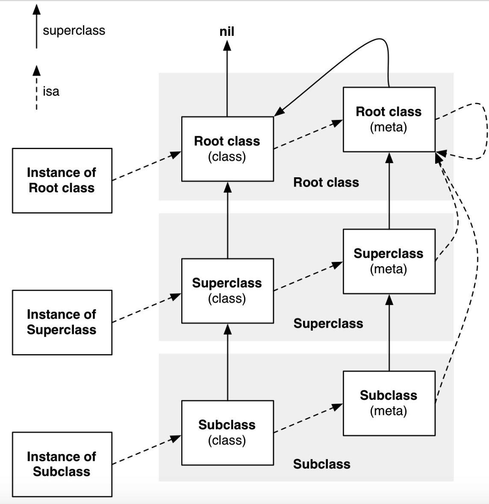

### 引言

在iOS开发中，我们经常需要对对象的类型进行判断，以便进行相应的处理。为了满足这一需求，Objective-C提供了两个非常有用的方法：`isKindOfClass`和`isMemberOfClass`。这两个方法都属于NSObject类，是Objective-C中常用的类型判断方法。

### 测试题

讲解`isKindOfClass`和`isMemberOfClass`的底层实现之前，可以先自行思考一下下面代码的运行结果。运行结果放在了文章的最后，可以和你心中的答案对照一下。

```objective-c
@interface Person : NSObject
@end

@implementation GGObject
@end

BOOL re1 = [(id)[NSObject class] isKindOfClass:[NSObject class]];
BOOL re2 = [(id)[NSObject alloc] isKindOfClass:[NSObject class]];
BOOL re3 = [(id)[Person class] isKindOfClass:[Person class]];
BOOL re4 = [(id)[Person alloc] isKindOfClass:[Person class]];   
NSLog(@" re1 :%hhd\n re2 :%hhd\n re3 :%hhd\n re4 :%hhd\n",re1,re2,re3,re4);   

BOOL re5 = [(id)[NSObject class] isMemberOfClass:[NSObject class]];
BOOL re6 = [(id)[NSObject alloc] isMemberOfClass:[NSObject class]];
BOOL re7 = [(id)[Person class] isMemberOfClass:[Person class]];
BOOL re8 = [(id)[Person alloc] isMemberOfClass:[Person class]];
NSLog(@" re5 :%hhd\n re6 :%hhd\n re7 :%hhd\n re8 :%hhd\n",re5,re6,re7,re8);
```

### isKindOfClass源码分析

`isKindOfClass`方法用于判断一个对象是否为指定类或其子类的实例。具体的使用方式是调用对象的`isKindOfClass`方法，并传入一个Class对象作为参数。如果对象是指定类或其子类的实例，则`isKindOfClass`方法返回YES；否则返回NO。那在[objc4-906](https://mrowlsage.github.io/posts/objc4-906-debug/)的具体实现如下：

```objective-c
// 并未真正走到此方法中
+ (BOOL)isKindOfClass:(Class)cls {
    for (Class tcls = self->ISA(); tcls; tcls = tcls->getSuperclass()) {
        if (tcls == cls) return YES;
    }
    return NO;
}

// 并未真正走到此方法中
- (BOOL)isKindOfClass:(Class)cls {
    for (Class tcls = [self class]; tcls; tcls = tcls->getSuperclass()) {
        if (tcls == cls) return YES;
    }
    return NO;
}

// 真正调用
// Calls [obj isKindOfClass]
BOOL
objc_opt_isKindOfClass(id obj, Class otherClass)
{
    if (slowpath(!obj)) return NO;
    // 首先获取isa(), 然后进行比较
    Class cls = obj->getIsa();
    if (fastpath(!cls->hasCustomCore())) {
        for (Class tcls = cls; tcls; tcls = tcls->getSuperclass()) {
            if (tcls == otherClass) return YES;
        }
        return NO;
    }

    return ((BOOL(*)(id, SEL, Class))objc_msgSend)(obj, @selector(isKindOfClass:), otherClass);
}

// 类方法
+ (Class)class {
    return self;
}

// 实例方法
- (Class)class {
    return object_getClass(self);
}

Class object_getClass(id obj)
{
	// 就是类对象
    if (obj) return obj->getIsa();
    else return Nil;
}
```

利用断点可以看到不论对象还是类调用`isKindOfClass`方法时底层真正调用的是`objc_opt_isKindOfClass`,通过源码可以看到`objc_opt_isKindOfClass`方法得内部逻辑是先获取isa，利用循环获取继承链进行逐一比较。

### isMemberOfClass源码分析

`isMemberOfClass`方法用于判断一个对象是否为指定类的实例，而不包括其子类。具体的使用方式是调用对象的`isMemberOfClass`方法，并传入一个Class对象作为参数。如果对象是指定类的实例，则`isMemberOfClass`方法返回YES；否则返回NO。那在[objc4-906](https://mrowlsage.github.io/posts/objc4-906-debug/)的具体实现如下：

```objective-c
// 类方法调用
+ (BOOL)isMemberOfClass:(Class)cls {
    return self->ISA() == cls;
}

// 实例方法调用
- (BOOL)isMemberOfClass:(Class)cls {
    return [self class] == cls;
}
```

从源码中可以看出，类方法调用时就是获取元类进行比较，实例方法的调用就是对类对象就行比较。

### 结果分析

分析结果之前还需要了解一下isa的流程图，如下图所示：



- instance的isa指向class

- class的isa指向meta-class

- meta-class的isa指向基类的meta-class

- class的superclass指向父类的class；如果没有父类，superclass指针为nil

- meta-class的superclass指向父类的meta-class；基类的meta-class的superclass指向基类的class
- instance调用对象方法的轨迹：isa找到class，方法不存在，就通过superclass找父类

- class调用类方法的轨迹：isa找meta-class，方法不存在，就通过superclass找父类

通过上述源码的分析同时结合类的继承与isa的指向图，相信再去看开篇的测试题应该就有了比较清晰的结果了。结果如下：

```objc
@interface Person : NSObject
@end

@implementation GGObject
@end

BOOL re1 = [(id)[NSObject class] isKindOfClass:[NSObject class]];
BOOL re2 = [(id)[NSObject alloc] isKindOfClass:[NSObject class]];
BOOL re3 = [(id)[Person class] isKindOfClass:[Person class]];
BOOL re4 = [(id)[Person alloc] isKindOfClass:[Person class]];   
NSLog(@" re1 :%hhd\n re2 :%hhd\n re3 :%hhd\n re4 :%hhd\n",re1,re2,re3,re4);   

BOOL re5 = [(id)[NSObject class] isMemberOfClass:[NSObject class]];
BOOL re6 = [(id)[NSObject alloc] isMemberOfClass:[NSObject class]];
BOOL re7 = [(id)[Person class] isMemberOfClass:[Person class]];
BOOL re8 = [(id)[Person alloc] isMemberOfClass:[Person class]];
NSLog(@" re5 :%hhd\n re6 :%hhd\n re7 :%hhd\n re8 :%hhd\n",re5,re6,re7,re8);

// 输出结果
// re1 :1 re2 :1 re3 :0 re4 :1
// re5 :0 re6 :1 re7 :0 re8 :1
```

